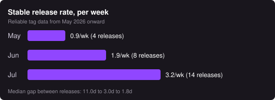

# [Kiro-CLI] Weekly Ops Review - 08/03/2026

**On Call:** abhraina | **Next:** shhvin | **Previous:** bskiser

## 1. Summary
* Pages: 19 across 10 tickets
* [Ticket Queue](https://t.corp.amazon.com/issues/?q=extensions.tt.status%3A%28Assigned%20OR%20Researching%20OR%20%22Work%20In%20Progress%22%20OR%20Pending%29%20AND%20extensions.tt.assignedGroup%3A%22Amazon%20Q%20for%20CLI%22): 167 → 139
* Incoming Tickets: 6
* Resolved Tickets: 37 (11 Sev2, 26 lower)
* Large Scale Significant Events: 0
* Releases Shipped: 3 (v2.15.1, v2.15.2, v2.16.0) | Avg 3.3 releases/week (trailing 4 weeks)

_Reliable tag data starts 2026-05-01; earlier months used chat-prefixed tagging and are not comparable._

## 2. Graphs
### Ticket Resolved Count By Root Cause (Previous week)

**Sev2 (11)**

| Root Cause | Count | Topic | Tickets |
|---|---|---|---|
| Defect - Code | 3 | Security vulnerabilities resolved: CWE-426 search path, CWE-427 Windows binary planting, grep -P permission bypass | [P476098688](https://t.corp.amazon.com/P476098688), [P479056395](https://t.corp.amazon.com/P479056395), [D479638291](https://t.corp.amazon.com/D479638291) |
| Downstream Dependency Issue | 3 | Backend model overload and InternalServerException driving QCLI-SuccessRateDown | [V2306322595](https://t.corp.amazon.com/V2306322595), [V2305734483](https://t.corp.amazon.com/V2305734483), [V2288565081](https://t.corp.amazon.com/V2288565081) |
| Defect - Alarm Configuration | 1 | QCLI-FirstTokenLatency: p90 threshold raised 15s to 25s per backend recommendation (CR-292836786 shipped, CR-292970467 open for dashboard annotation and SEV2 to SEV2.5) | [V2279916688](https://t.corp.amazon.com/V2279916688) |
| Defect - Alarm Configuration | 1 | QCLI-SuccessRateDown: EmptyResponse reclassified from system failure to user failure (CR-292786335 and CR-292839013 pending Toolkit team approval) | [V2304775994](https://t.corp.amazon.com/V2304775994) |
| Customer Information Request | 1 | Netsmart Windows Defender credential-access report answered as a false positive | [V2299574204](https://t.corp.amazon.com/V2299574204) |
| Security Campaign | 1 | Delta compliance violation resolved | [P472355122](https://t.corp.amazon.com/P472355122) |
| Working as Intended | 1 | SOC workspace-MCP report confirmed as documented, by-design behavior | [V2291407506](https://t.corp.amazon.com/V2291407506) |
| Total | 11 |  |  |

**Non-Sev2 (26)**

| Root Cause | Count | Topic | Tickets |
|---|---|---|---|
| Customer Information Request | 10 | FRs converted, questions answered, stale tickets closed | [P441214514](https://t.corp.amazon.com/P441214514), [V2220062060](https://t.corp.amazon.com/V2220062060), [P431390760](https://t.corp.amazon.com/P431390760), [V2297152702](https://t.corp.amazon.com/V2297152702), [P463723344](https://t.corp.amazon.com/P463723344), [D499857327](https://t.corp.amazon.com/D499857327), [P452734657](https://t.corp.amazon.com/P452734657), [D470361599](https://t.corp.amazon.com/D470361599), [D451478471](https://t.corp.amazon.com/D451478471), [P381873550](https://t.corp.amazon.com/P381873550) |
| Defect - Code | 5 | Bug fixes shipped: subagent delegation and crew orchestration, FORCE_COLOR, focus-event leak, kiroignore bypass | [P461702748](https://t.corp.amazon.com/P461702748), [P459152339](https://t.corp.amazon.com/P459152339), [P466117728](https://t.corp.amazon.com/P466117728), [V2249141083](https://t.corp.amazon.com/V2249141083), [P391106686](https://t.corp.amazon.com/P391106686) |
| Release | 4 | Stable releases v2.15.0, v2.15.1, v2.15.2, v2.16.0 | [P478978099](https://t.corp.amazon.com/P478978099), [P480637997](https://t.corp.amazon.com/P480637997), [P481868207](https://t.corp.amazon.com/P481868207), [P482547495](https://t.corp.amazon.com/P482547495) |
| Defect - Alarm Configuration | 2 | QCLIErrorCount and QCLIErrorCount-tmp: 4xx user-error alarms closed as redundant and non-actionable, page-worthy CLI health is QCLIFaultCount (5xx) plus RTS success rate | [V2246245683](https://t.corp.amazon.com/V2246245683), [V2246593798](https://t.corp.amazon.com/V2246593798) |
| Stale Ticket Cleanup | 2 | QCLIFaultCount and an aged QCLI-SuccessRateDown ticket closed as no longer relevant, no root cause established | [V2290788177](https://t.corp.amazon.com/V2290788177), [V2243924150](https://t.corp.amazon.com/V2243924150) |
| Downstream Dependency Issue | 1 | Backend-owned cache-hit-rate alarm for claude-opus-4.7 | [V2274501749](https://t.corp.amazon.com/V2274501749) |
| False Alarm | 1 | Customer misconfiguration | [P461334429](https://t.corp.amazon.com/P461334429) |
| Only Support Ops can address | 1 | GovCloud profileArn issue (fixed in v2.9.0+) | [V2248275776](https://t.corp.amazon.com/V2248275776) |
| Total | 26 |  |  |

## 3. Operational Pain Level

_Pick one (1-10) during the ops review._

Suggested: 4 - Nineteen pages across ten distinct tickets, including a customer security escalation and a compliance violation. All alarm pages were backend-caused or self-recovered. Heavy queue cleanup (167 to 139) and three stable releases shipped cleanly.

## 4. Large Scale Significant Events
* None

## 5. Previous Week's Action Items

During the meeting, go over open action items here https://tiny.amazon.com/1auvbeoty/taskamazdevroom7c22task

## 6. Page Log

_One row per paged ticket. Pages = notifications delivered to the primary oncall (abhraina) during the week, sourced from the paging system. Sorted by page count._

| # | Ticket | Pages | First Page (PT) | Page Sequence | Impact Summary | Root Cause | Mitigation | Action Items | Risk of Recurrence | Related Tickets |
|---|---|---|---|---|---|---|---|---|---|---|
| 1 | [V2299574204](https://t.corp.amazon.com/V2299574204) | 4 | 07-27 13:24 | Upgraded ×3, Reopened | Customer (Netsmart) reported Windows Defender flagging Kiro CLI for credential access | AppContainer sandbox (kiro-sandbox.exe) sets DENY ACEs on credential store paths; EDR misreads ACL writes as file reads | Explained false positive to customer; WSL uses linux binary not exe | None - false positive confirmed | Low - expected EDR behavior on Windows | None |
| 2 | [P472355122](https://t.corp.amazon.com/P472355122) | 4 | 07-28 10:00 | Rotated ×3, Reassigned | GRC-Next deployment monitoring violation on FigIoDesktopDeploy pipeline | Delta compliance violation on production resource | kennvene resolved violation in GRC-Next; abhraina pushed CRs | None recorded | Low - resolved | None |
| 3 | [D499857327](https://t.corp.amazon.com/D499857327) | 3 | 07-27 09:30 | Upgraded ×2, Escalated | Customer (EHG GmbH, eu-central-1) could not select claude-opus-4.6, model reported unavailable | Backend returned ValidationException INVALID_MODEL_ID, consistent with an entitlement or regional model-config change | Answered customer with the model-availability explanation | None recorded | Medium - regional model config changes are backend-driven and not client-visible | None |
| 4 | [V2305734483](https://t.corp.amazon.com/V2305734483) | 2 | 07-29 09:39 | New Sev2, Escalated | Success rate dropped below 99% threshold due to backend model issues | Backend model availability issues; claude-fable-5 accounted for 94% of InternalServerExceptions | Self-recovered; backend team handling | CR-292786335 and CR-292839013 pending Toolkit team approval | Low - alarm reclassification CRs will prevent future false pages | None |
| 5 | [V2277483794](https://t.corp.amazon.com/V2277483794) | 1 | 07-27 09:54 | Escalated | Customer (T.Rowe Price) unable to complete Kiro CLI OAuth flow | Downstream dependency, not yet root-caused | Awaiting customer response | Still open, see Section 7 | TBD | None |
| 6 | [V2264387664](https://t.corp.amazon.com/V2264387664) | 1 | 07-31 10:36 | Escalated | Cataphract AI static analysis flagged potential vulnerabilities in source code | Automated security scan findings requiring triage | Pending root cause analysis | TBD | TBD | None |
| 7 | [V2291407506](https://t.corp.amazon.com/V2291407506) | 1 | 07-31 11:55 | Escalated | Security researcher reported workspace MCP config auto-execution without consent | Workspace MCP server loading is documented, intentional design for --classic/--v2 modes | Confirmed working-as-intended with public documentation; SOC closed | Workspace trust for --v3 tracked separately | Low - by-design behavior, documented | [V2291411850](https://t.corp.amazon.com/V2291411850) |
| 8 | [V2304775994](https://t.corp.amazon.com/V2304775994) | 1 | 07-28 15:25 | New Sev2 | Success rate dropped below 99% threshold due to EmptyResponse errors classified as system failures | EmptyResponse errors from backend incorrectly classified as system failures in telemetry dashboard | Self-recovered; reclassified EmptyResponse as user failure type | CR-292786335 and CR-292839013 pending Toolkit team approval | Low - alarm reclassification CRs will prevent future false pages | None |
| 9 | [V2279916688](https://t.corp.amazon.com/V2279916688) | 1 | 07-28 16:18 | Upgraded | p90 first-token latency exceeded 15s threshold (sustained ~16s) | Alarm threshold too low for current backend latency baseline | Raised threshold from 15s to 25s per backend recommendation (CR-292836786 shipped) | CR-292970467 pending for dashboard annotation update | Low - threshold raised permanently | None |
| 10 | [V2306322595](https://t.corp.amazon.com/V2306322595) | 1 | 07-29 18:48 | New Sev2 | Success rate dropped below 99% threshold due to backend issues | Backend issues causing elevated error rates | Self-recovered | CR-292786335 and CR-292839013 pending Toolkit team approval | Low - alarm reclassification CRs will prevent future false pages | None |
| | **Total** | **19** | | | | | | | | |

## 7. Open Sev2s

| # | Ticket | Description | Next Step | ETA To Resolve |
|---|---|---|---|---|
| 1 | [V2277483794](https://t.corp.amazon.com/V2277483794) | Kiro CLI OAuth not working - T.Rowe Price Associates Inc. | Awaiting customer response on downstream dependency resolution | TBD |
| 2 | [V2264387664](https://t.corp.amazon.com/V2264387664) | [Heartwork] Cataphract AI detected general vulnerabilities in source code | Pending root cause analysis of Cataphract findings | TBD |

## 8. Open Queue by Category (138 open as of 08/03)

| Category | Count | Share | What it covers |
|---|---|---|---|
| Security and trust boundary | 32 | 23% | AppSec, Bug Bounty, SOC, SIRT and CorpSec reports plus permission-engine defects: shell-command trust matching, subagent permission derivation, `use_aws` parameter validation, symlink bypass in `fs_read`/`fs_write`, prompt injection, asset-extraction integrity, container base images |
| MCP servers and tools | 17 | 12% | Server registration, transport reliability, tool-surface consistency: `mcp.json` not inherited by custom agents or subagents, tool-name validation dropping nested-proxy tools, `tools/call` cancel and double-invoke, governance gating disabling MCP, streamable-http failures |
| TUI and terminal | 16 | 12% | Rendering and input handling: theme colours resolving to terminal defaults, viewport and scroll behaviour, key decoding on non-Kitty terminals, tmux cursor and reflow, plan-mode approval detail hidden |
| Auth and connectivity | 16 | 12% | Login, token and transport failures: SSO and OAuth, `profileArn` resolution, bearer-token invalidation, corporate proxy and firewall blocking, `dispatch failure` from ConnectionReset, headless and service identity |
| Platform and packaging | 14 | 10% | Install and platform integration: AL2 and AL2023 support, SSH config generation for OpenSSH 7.4, Windows auto-update, shell-integration conflicts, macOS arm64 bundle |
| Stability and crashes | 13 | 9% | SIGKILL and SIGTRAP under piped stdio, panics, oversized tool results and `web_fetch` responses, image dimension limits, `tool_use`/`tool_result` invariant repair |
| Context and model behaviour | 13 | 9% | Compaction, context-overflow visibility, effort and thinking controls, image and multimodal accounting, session export integrity, fabricated tool calls |
| Subagents and hooks | 8 | 6% | Hook context injection and transcript corruption, per-stage model override ignored, agent composition and `resources` field |
| Compliance and measurement | 5 | 4% | Accessibility remediation deadlines, certification posture, usage and efficiency reporting |
| Release infra and access | 4 | 3% | KiroCliDeploy Lambda idempotency and commit-specific S3 pathing, kiro-team GitHub org access sync |
| **Total** | **138** | **100%** | |

Categories carried over from the 2026-07-29 evidence triage, which read every ticket individually. 135 of the 138 currently open were already classified there; the 3 opened since were classified by hand. Section 1 reports 139 as the week-ending figure; one ticket has closed since, so this table sums to 138.

**Observations**

* Security is the largest category and cannot be bulk-closed, but it is not 32 independent defects. Roughly two thirds cluster into seven shared root causes (trust matcher, `use_aws` validation, subagent permission derivation, config-declared execution, default guardrail requests, asset-extraction integrity, container images), with the remainder genuine singletons.
* Three tickets share one root cause: [P403116931](https://t.corp.amazon.com/P403116931), [V2126340432](https://t.corp.amazon.com/V2126340432) and [P443070433](https://t.corp.amazon.com/P443070433) are all the AL2 / OpenSSH 7.4 `SetEnv` incompatibility. One version-gated fix clears all three.
* Ericsson AB accounts for 4 open tickets ([P407700962](https://t.corp.amazon.com/P407700962), [V2210001734](https://t.corp.amazon.com/V2210001734), [V2255203247](https://t.corp.amazon.com/V2255203247), [V2273841818](https://t.corp.amazon.com/V2273841818)), a candidate for a single account escalation rather than four separate threads.
* Two duplicate pairs are still open and each needs a determination naming the survivor before either side can close: [P461034891](https://t.corp.amazon.com/P461034891) / [D480144322](https://t.corp.amazon.com/D480144322) (auto-scroll) and [V2270716926](https://t.corp.amazon.com/V2270716926) / [V2290239698](https://t.corp.amazon.com/V2290239698) (identical AppSec container-image finding).
* 5 tickets predate 2026. The two oldest, [P215506468](https://t.corp.amazon.com/P215506468) and [P215471809](https://t.corp.amazon.com/P215471809), were filed 2025-03-25 and have each been bulk-closed once and reopened by their requesters.

## 9. Security Risks

_To be reviewed during the meeting._

* Acknowledge High/Critical risks https://policyengine.amazon.com/dashboard/abhraina
* OS Patching https://mirador.security.aws.dev/#/insights/patching?viewingAs=abhraina
* AppSec findings https://mirador.security.aws.dev/#/findings?viewingAs=abhraina
* SAS risks https://sas.corp.amazon.com/summary/all/abhraina

## 10. Tickets Cut to Other Teams

| # | Team - Ticket | Description |
|---|---|---|
| 1 | Toolkit Telemetry - [CR-292786335](https://code.amazon.com/reviews/CR-292786335) | Reclassify EmptyResponse as user failure in KiroTelemetryCDK |
| 2 | Toolkit Telemetry - [CR-292839013](https://code.amazon.com/reviews/CR-292839013) | Reclassify EmptyResponse as user failure in ToolkitTelemetryInfrastructure |

## 11. Dashboard Review

Add dashboard spikes related findings here [[Kiro-CLI] Weekly Dashboard Investigation Notes](https://quip-amazon.com/umwaAzDXcFo1)
