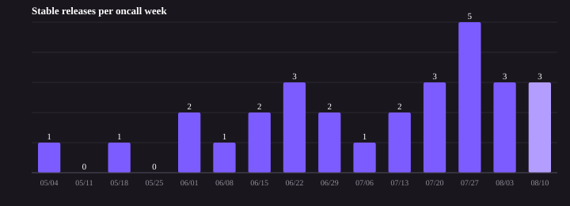

# [Kiro-CLI] Weekly Ops Review - 08/10/2026

**On Call:** shhvin | **Next:** zoelin | **Previous:** abhraina

## 1. Summary
* Pages: 10 across 10 tickets (3 outside work hours; +1 manager escalation to girpooja on V2277483794, reported separately)
* [Ticket Queue](https://t.corp.amazon.com/issues/?q=extensions.tt.status%3A%28Assigned%20OR%20Researching%20OR%20%22Work%20In%20Progress%22%20OR%20Pending%29%20AND%20extensions.tt.assignedGroup%3A%22Amazon%20Q%20for%20CLI%22): 139 → 153
* Incoming Tickets: 14 (24 raw; the QCLI-SuccessRateDown alarm storm of 8 collapses to 1 issue and 4 SmokeBot failures to 1)
* Resolved Tickets: 14 (10 Sev2, 4 lower)
* Large Scale Significant Events: 0
* Releases Shipped: 3 (v2.16.1, v2.16.2, v2.17.0) | Avg 3.5 releases/week (trailing 4 weeks)

_Reliable tag data starts 2026-05-01; earlier months used chat-prefixed tagging and are not comparable._

## 2. Graphs
### Ticket Resolved Count By Root Cause (Previous week)

_Split by severity, Sev2 first. Severity is the ticket's **current** severity, so a ticket
that paged at Sev2 and was later downgraded appears in the Non-Sev2 table._

**Sev2 (10)**

| Root Cause | Count | Topic | Tickets |
|---|---|---|---|
| Backend model capacity (transient) | 5 | QCLI-SuccessRateDown alarm; self-recovered ModelOverloadedError / response-error spikes, no CLI regression | [V2313134676](https://t.corp.amazon.com/V2313134676), [V2314699023](https://t.corp.amazon.com/V2314699023), [V2315654467](https://t.corp.amazon.com/V2315654467), [V2315843441](https://t.corp.amazon.com/V2315843441), [V2319359548](https://t.corp.amazon.com/V2319359548) |
| Alarm sensitivity / metric taxonomy | 3 | QCLI-SuccessRateDown flapping the 99% threshold; RecvErrorEmptyResponse not excluded — fixed by CR-295425399 (deployed) | [V2317754397](https://t.corp.amazon.com/V2317754397), [V2317764871](https://t.corp.amazon.com/V2317764871), [V2317768863](https://t.corp.amazon.com/V2317768863) |
| Defect - MCP OAuth (client) | 1 | Kiro sent an RFC 8707 resource param to Entra ID v2; fixed via rmcp 3.0.0 (PR #3743). Field said "Downstream Dependency" but the defect is client-side | [V2277483794](https://t.corp.amazon.com/V2277483794) |
| Security finding - supply chain | 1 | Heartwork/Cataphract: FigIoDesktopDeploy Linux build role could read the PGP signing key; remediated (CR-289040183 et al.) | [V2264387664](https://t.corp.amazon.com/V2264387664) |
| Total | 10 |  |  |

**Non-Sev2 (4)**

| Root Cause | Count | Topic | Tickets |
|---|---|---|---|
| Security finding (resolved) | 2 | SOC agentSpawn-hooks RCE campaign closed; AppSec external-repo container-image finding auto-resolved | [P447215132](https://t.corp.amazon.com/P447215132), [V2270716926](https://t.corp.amazon.com/V2270716926) |
| Release | 1 | Kiro CLI 2.16.1 release ticket closed this week (release tickets closed ≠ releases shipped) | [P484875442](https://t.corp.amazon.com/P484875442) |
| Working as Intended (synthetic test) | 1 | SmokeBot synthetic smoke-failure test ticket, safe to resolve | [P486927863](https://t.corp.amazon.com/P486927863) |
| Total | 4 |  |  |

## 3. Operational Pain Level

**7/10** (set by oncall shhvin during review) — the week's pain was dominated by manual release toil: cutting 2.17.0 required admin-assisted cleanup of a stale release branch, catch-up PRs, several rounds of feed.json changelog review, and manual approval gates across the stable → beta → prod promotion. Paging itself was moderate (10 pages, 8 from the single QCLI-SuccessRateDown alarm), so the interrupt load was not the driver — the hands-on release process was.

## 4. Large Scale Significant Events
* None

## 5. Previous Week's Action Items

During the meeting, go over open action items here https://tiny.amazon.com/1auvbeoty/taskamazdevroom7c22task

Candidate items surfaced this week:
* **Done** — CR-295425399 (exclude RecvErrorEmptyResponse from QCLI-SuccessRateDown) merged and deployed; alarm stable ~99.5% since 08-08 04:06 UTC.
* **Open** — P473397715: decide and commit an ECD for adding default path exclusions to the `/knowledge add` indexer (AppSec-reproduced credential-store reads).
* **Open** — P488415895: fix KiroCLI 2.13.0 so `ListAvailableProfiles` uses the OIDC/SSO bearer token, and consider fast-tracking users off 2.13.0.

## 6. Page Log

_One row per paged ticket. Pages = notifications delivered to the primary oncall (shhvin) during the week, sourced from Builder Insights (PAGING/pages_dim_derived_v2). Sorted by page count._

| # | Ticket | Pages | First Page (PT) | Page Sequence | Impact Summary | Root Cause | Mitigation | Action Items | Risk of Recurrence | Related Tickets |
|---|---|---|---|---|---|---|---|---|---|---|
| 1 | [V2313134676](https://t.corp.amazon.com/V2313134676) | 1 | 08-04 08:48 | New Sev2 | QCLI-SuccessRateDown alarm paged oncall; brief success-rate dip, no customer-facing regression | Transient upstream model capacity pressure - ModelOverloadedError rose 4->512->2,343 (15:33-15:43 UTC), ~91% of system failures at peak | Self-recovered; alarm returned OK 16:04 UTC with no operator action | None recorded (backend model capacity) | Medium - recurring model-overload capacity pressure | Backend model-serving (mantle) |
| 2 | [P473397715](https://t.corp.amazon.com/P473397715) | 1 | 08-05 09:30 | Upgraded | External AWS SOC report: Defender flagged kiro-cli.exe reading Chrome Login Data/Web Data and AWS credential files on a customer workstation | The /knowledge add indexer recursively reads every file in a user-chosen directory with no default exclusions (AppSec-reproduced), so it reads credential stores as ordinary files; shipped product behavior, binary confirmed authentic | None yet - binary provenance cleared; awaiting product decision on default path exclusions | Product team to add default path exclusions to the knowledge indexer + answer egress question (SAURON-378406, open) | High - credential-store reads with no exclusions; ticket bumped toward Sev-2.5 | V2299574204 (parallel customer case); SAURON-378406 |
| 3 | [V2314699023](https://t.corp.amazon.com/V2314699023) | 1 | 08-05 12:20 | New Sev2 | QCLI-SuccessRateDown alarm; success rate dipped to 97.84%/98.70% at 19:05/19:15 UTC | Transient model issue (backend); ModelOverloadedError co-spiked with InternalServerException | Self-recovered within ~10 minutes | None recorded (backend) | Medium | Backend model-serving |
| 4 | [V2315654467](https://t.corp.amazon.com/V2315654467) | 1 | 08-06 06:46 | New Sev2 | QCLI-SuccessRateDown alarm; single 5-min spike drove success rate to 93.36% at 13:40 UTC | Transient backend/model-serving degradation in the generic response-error bucket; all client-side reasons stayed flat | Self-recovered to ~99.7% by 13:50; alarm OK 13:56 UTC | None recorded (backend) | Medium | Backend model-serving |
| 5 | [V2315843441](https://t.corp.amazon.com/V2315843441) | 1 | 08-06 09:51 | New Sev2 | QCLI-SuccessRateDown alarm; sustained success-rate drop 16:45-17:05 UTC | Model-serving capacity issue - ModelOverloadedError rose 48->9,997 at 16:45 UTC while volume held; no CLI regression | Backend (mantle) recovered | None recorded (backend) | Medium | Backend model-serving |
| 6 | [V2277483794](https://t.corp.amazon.com/V2277483794) | 1 | 08-07 11:57 | Escalated | Enterprise customer T.Rowe Price blocked from all M365 MCP servers via native OAuth | Kiro's bundled MCP OAuth client sends an RFC 8707 resource param derived from the server URL to the Entra ID v2 endpoint, which rejects it (AADSTS9010010 with scopes, AADSTS900144 without) - a client-side incompatibility, not a downstream outage despite the field label | Fixed by upgrading rmcp to 3.0.0 (upstream rust-sdk PR #962); Kiro PR #3743, ships next release | Ship rmcp 3.0.0 bump (PR #3743) | Low once released | modelcontextprotocol/rust-sdk#962; escalated to manager (girpooja) |
| 7 | [V2317754397](https://t.corp.amazon.com/V2317754397) | 1 | 08-07 18:26 | New Sev2 | QCLI-SuccessRateDown alarm flapped across the 99% threshold overnight (self-recovered in 3 min) | Alarm sensitivity / metric taxonomy - RecvErrorEmptyResponse not excluded from systemFailures while overnight volume tapered; two 5-min datapoints landed just under 99% | Follow-up CR-295425399 opened to add RecvErrorEmptyResponse to the alarm exclusion list | CR-295425399 (ToolkitTelemetryInfrastructure) | Medium until fix deployed | Same overnight flap sequence (fixed by CR-295425399) |
| 8 | [V2317764871](https://t.corp.amazon.com/V2317764871) | 1 | 08-07 18:39 | New Sev2 | QCLI-SuccessRateDown re-page minutes after the first flap; same flapping band | Duplicate flap of the same alarm; RecvErrorEmptyResponse not excluded from systemFailures | Covered by CR-295425399 | CR-295425399 | Medium until fix deployed | Same overnight flap sequence (fixed by CR-295425399) |
| 9 | [V2317768863](https://t.corp.amazon.com/V2317768863) | 1 | 08-07 18:44 | New Sev2 | QCLI-SuccessRateDown re-page; final flap of the overnight sequence | Alarm sensitivity - RecvErrorEmptyResponse (V1 twin of the already-excluded EmptyResponse) | CR-295425399 deployed 04:06 UTC; alarm stable ~99.5% with zero transitions since | CR-295425399 (merged + deployed) | Low - fixed | Same overnight flap sequence (fixed by CR-295425399) |
| 10 | [V2319359548](https://t.corp.amazon.com/V2319359548) | 1 | 08-09 06:21 | New Sev2 | QCLI-SuccessRateDown alarm; success rate fell below 99% ~13:10 UTC | ModelOverloadedError spiked (backend capacity) from baseline to ~190-212/5min | Self-recovered as capacity pressure eased | None recorded (backend) | Medium | Backend model-serving |
| | **Total** | **10** | | | | | | | | |

_Shared infrastructure: 8 of the 10 pages are the single QCLI-SuccessRateDown alarm (us-east-1). It splits into two causes — 5 self-recovering backend model-capacity spikes and 3 alarm-sensitivity flaps now fixed by CR-295425399. Escalation tier: 1 manager escalation (page-girpooja) fired on V2277483794, ~1s after the oncall page; reported separately and not folded into the 10._

## 7. Open Sev2s

| # | Ticket | Description | Next Step | ETA To Resolve |
|---|---|---|---|---|
| 1 | [P488415895](https://t.corp.amazon.com/P488415895) | KiroCLI 2.13.0 sends an API-key credential on `ListAvailableProfiles`, which only accepts OIDC/SSO bearer tokens → 100% InvalidTokenException, ~590K failed calls/day and growing. No service/customer impact but it tripped the AuthProxy alarm (V2310285730). Intended Sev-2.5, filed Sev-3 by tooling. | Fix client to use the OIDC/SSO bearer token for `ListAvailableProfiles` (tied to the API Keys feature); consider fast-tracking users off 2.13.0. zoelin investigating. | TBD |
| 2 | [P473397715](https://t.corp.amazon.com/P473397715) | AWS SOC/Defender flagged kiro-cli.exe reading Chrome credential stores + AWS creds. AppSec reproduced the mechanism: the `/knowledge add` indexer recursively reads every file in a chosen directory with no default exclusions. Binary confirmed authentic; product-design defect, not malware. Bumped toward Sev-2.5 for engagement. | Product team to acknowledge the AppSec reproduction and commit an ECD for default path exclusions in the knowledge indexer; answer the network-egress question. | TBD (SAURON-378406) |

## 8. Open Queue by Category (153 open as of 08/10)

<!-- Generated per the skill's "Open queue composition" procedure: classify every open
     ticket into exactly one of the ten canonical categories, fresh each week. One row per
     non-zero category, sorted by count descending; omit empty categories. This is a
     snapshot of current composition, NOT a trend - do not state week-over-week deltas. -->

| Category | Count | Share | What it covers |
|---|---|---|---|
| Security and trust boundary | 29 | 19% | AppSec/bug-bounty/SOC findings plus permission-engine and trust-boundary defects (trust matching, symlink/sandbox bypass, prompt injection, supply chain) |
| Platform and packaging | 16 | 10% | Install/update/OS integration: distro support, SSH config generation, auto-update, shell integration, per-arch bundles |
| Auth and connectivity | 15 | 10% | Login, token and transport failures: SSO/OAuth/IdP, profileArn, bearer tokens, dispatch failure, usage-limit/entitlement |
| Stability and crashes | 15 | 10% | Panics, signals, hangs, oversized tool results/responses, media limits, tool_use/tool_result invariant damage |
| Subagents and hooks | 14 | 9% | Subagent orchestration and lifecycle hooks: MCP inheritance, model/config overrides, hook-induced transcript corruption |
| Other | 14 | 9% | Does not fit a category. IDs: [V2308110975](https://t.corp.amazon.com/V2308110975), [V2304984688](https://t.corp.amazon.com/V2304984688), [P480880358](https://t.corp.amazon.com/P480880358), [P464609990](https://t.corp.amazon.com/P464609990), [V2261880005](https://t.corp.amazon.com/V2261880005), [P449059931](https://t.corp.amazon.com/P449059931), [D450726738](https://t.corp.amazon.com/D450726738), [P431388657](https://t.corp.amazon.com/P431388657), [P428053068](https://t.corp.amazon.com/P428053068), [P423601484](https://t.corp.amazon.com/P423601484), [D434806977](https://t.corp.amazon.com/D434806977), [V2160588349](https://t.corp.amazon.com/V2160588349), [V2158904217](https://t.corp.amazon.com/V2158904217), [P215471809](https://t.corp.amazon.com/P215471809) |
| MCP servers and tools | 13 | 8% | Server registration/discovery, transport reliability, tool-name handling, tools/call lifecycle, MCP governance gating |
| TUI and terminal | 13 | 8% | Rendering/input: theme/color, viewport/scroll, key decoding, cursor, tmux, approval-time display |
| Context and model behaviour | 10 | 7% | Compaction, context-window accounting/visibility, effort/thinking controls, multimodal accounting, fabricated tool calls |
| Release infra and access | 9 | 6% | Release pipeline and repo/org access: deploy Lambdas, artifact pathing, smoke tests, GitHub org/permission sync |
| Compliance and measurement | 5 | 3% | Externally committed obligations: accessibility deadlines, security questionnaires, usage/efficiency reporting |
| **Total** | **153** | **100%** | |

_Classification was done fresh this week over the 153 currently-open tickets; category counts are a snapshot of current composition and are re-classified fresh each week, so they are not comparable across weeks. This total (153, measured when the report ran) matches the Section 1 week-ending queue figure this week; in general the two can differ because Section 1 is measured at the 09:30 handoff boundary._

**Observations**

* QCLI-SuccessRateDown remains the dominant paging source (8 of 10 pages). The alarm-sensitivity half is now fixed (CR-295425399); the remaining pages are self-recovering backend model-capacity spikes that produce no customer-facing regression — a candidate for backend-side capacity follow-up rather than client work.
* Security is the largest open bucket (29/153, 19%) and skews old — long-open AppSec/bug-bounty/SOC findings (e.g. P375836923, P374306511, V2137956389, P368143082) that are not paging but are aging well beyond the rest of the queue. Worth a dedicated security-backlog burn-down.
* Duplicate/related pairs to reconcile: auto-scroll-to-top ([D480144322](https://t.corp.amazon.com/D480144322) & [P461034891](https://t.corp.amazon.com/P461034891)); the AWS AppSec "container images in external repositories" finding is open as [V2290239698](https://t.corp.amazon.com/V2290239698) while its twin [V2270716926](https://t.corp.amazon.com/V2270716926) was resolved this week.
* MCP-not-loading-in-agents cluster ([P469142995](https://t.corp.amazon.com/P469142995), [P468796857](https://t.corp.amazon.com/P468796857), [P428266898](https://t.corp.amazon.com/P428266898), [P477946909](https://t.corp.amazon.com/P477946909)) shares one root theme — subagents/custom agents not inheriting MCP servers — and could be fixed as a group.

## 9. Security Risks

_To be reviewed during the meeting._

* Acknowledge High/Critical risks https://policyengine.amazon.com/dashboard/shhvin
* OS Patching https://mirador.security.aws.dev/#/insights/patching?viewingAs=shhvin
* AppSec findings https://mirador.security.aws.dev/#/findings?viewingAs=shhvin
* SAS risks https://sas.corp.amazon.com/summary/all/shhvin

_This week's headline security item is [P473397715](https://t.corp.amazon.com/P473397715): AppSec reproduced that the `/knowledge add` indexer reads browser and AWS credential stores with no default path exclusions — a shipped product-design defect needing a remediation ECD._

## 10. Tickets Cut to Other Teams

| # | Team - Ticket | Description |
|---|---|---|
| 1 | Toolkit Telemetry (DAE) - [CR-295425399](https://code.amazon.com/reviews/CR-295425399) | Oncall-driven cross-team fix in ToolkitTelemetryInfrastructure to exclude RecvErrorEmptyResponse from the QCLI-SuccessRateDown system-failure math; approved (xianwp + bskiser), merged by package owner, deployed 08-08. Stopped the overnight alarm flapping. |

_No tickets were reassigned to other teams this week (partner-tag search returned none); the one cross-team item was the CR above._

## 11. Dashboard Review

Add dashboard spikes related findings here [[Kiro-CLI] Weekly Dashboard Investigation Notes](https://quip-amazon.com/umwaAzDXcFo1)
