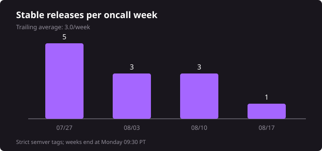

# [Kiro-CLI] Weekly Ops Review - 08/17/2026

**On Call:** zoelin | **Next:** dingfeli | **Previous:** shhvin

## 1. Summary
* Pages: 8 across 8 tickets (degraded engagements fallback; per-ticket notification counts and outside-hours counts unavailable)
* [Ticket Queue](https://t.corp.amazon.com/issues/?q=extensions.tt.status%3A%28Assigned%20OR%20Researching%20OR%20%22Work%20In%20Progress%22%20OR%20Pending%29%20AND%20extensions.tt.assignedGroup%3A%22Amazon%20Q%20for%20CLI%22): 153 → 153
* Incoming Tickets: 16 (21 raw; two QCLI-SuccessRateDown tickets collapse to one issue, four identical invalid-leg SmokeBot tickets collapse to one, and two identical inconsistent-verdict tickets collapse to one)
* Resolved Tickets: 16 (1 Sev2, 15 lower)
* Large Scale Significant Events: 0
* Releases Shipped: 3 (v2.17.0, v2.18.0, v2.18.1) | Avg 3.3 releases/week (trailing 4 weeks)

_Release counts use successful public CloudFront production promotions rather than stable-tag creation times._

## 2. Graphs
### Ticket Resolved Count By Root Cause (Previous week)

_Split by severity, Sev2 first. Severity is the ticket's **current** severity, so tickets that paged at Sev2 and were later downgraded appear in the Non-Sev2 table._

**Sev2 (1)**

| Root Cause | Count | Topic | Tickets |
|---|---|---|---|
| Working as Intended / no issue | 1 | Security review closed after validation concluded Kiro did not access the credential store | [P473397715](https://t.corp.amazon.com/P473397715) |
| Total | 1 |  |  |

**Non-Sev2 (15)**

| Root Cause | Count | Topic | Tickets |
|---|---|---|---|
| Test infrastructure failure | 4 | SmokeBot judge emitted invalid or internally inconsistent leg results without evidence of a CLI defect; ticket fields labeling two as release tickets were overridden by their descriptions | [P487800125](https://t.corp.amazon.com/P487800125), [P490847964](https://t.corp.amazon.com/P490847964), [P491197513](https://t.corp.amazon.com/P491197513), [P493245390](https://t.corp.amazon.com/P493245390) |
| Release | 3 | Release tracking tickets closed or superseded this week; release tickets closed are not the same unit as releases shipped | [P486126350](https://t.corp.amazon.com/P486126350), [P487400785](https://t.corp.amazon.com/P487400785), [P489150075](https://t.corp.amazon.com/P489150075) |
| Duplicate | 3 | Two OpenSSH 7.4 SetEnv reports consolidated into V2126340432; auto-scroll report consolidated into D480144322 | [P403116931](https://t.corp.amazon.com/P403116931), [P443070433](https://t.corp.amazon.com/P443070433), [P461034891](https://t.corp.amazon.com/P461034891) |
| Downstream dependency issue | 2 | First-token latency and success-rate alarms resolved after downstream model-serving recovery | [V2321344948](https://t.corp.amazon.com/V2321344948), [V2322113921](https://t.corp.amazon.com/V2322113921) |
| Product defect - subagent model handling | 1 | Dotted model version was rewritten during subagent dispatch, breaking the selected model | [P472601597](https://t.corp.amazon.com/P472601597) |
| Feature request / capability gap | 1 | GPT-5.6 Sol readable reasoning summaries are not currently supported over ACP | [P492031704](https://t.corp.amazon.com/P492031704) |
| Working as Intended - unsupported platform | 1 | Debian 12 on VirtualBox is outside the supported macOS, Ubuntu, and Cloud Desktop platforms | [V2184334418](https://t.corp.amazon.com/V2184334418) |
| Total | 15 |  |  |

## 3. Operational Pain Level

_Pick one (1–10) during the ops review._

**Suggested: 7/10** — eight paged tickets included six customer-impacting Mantle overload episodes under one reused alarm ticket, while OAuth cases and release work added sustained follow-up load. This is a suggestion for the oncall to confirm during review.

## 4. Large Scale Significant Events
* None

## 5. Previous Week's Action Items

During the meeting, go over open action items here https://tiny.amazon.com/1auvbeoty/taskamazdevroom7c22task

Candidate carried-forward items:
* **Closed** — [P473397715](https://t.corp.amazon.com/P473397715): security review resolved as no issue after validation concluded Kiro did not access the credential store.
* **Open** — [P488415895](https://t.corp.amazon.com/P488415895): fix ListAvailableProfiles credential selection and confirm whether KAS shares the 2.13.0 application-loop behavior.
* **Open** — [P491128276](https://t.corp.amazon.com/P491128276): track durable Mantle gateway/autoscaling and availability-alarm improvements after the repeated cell3 overload episodes.

## 6. Page Log

_One row per paged ticket. Because Builder Insights was unavailable, this uses the degraded engagements fallback: it identifies paged tickets but overwrites notification history, so every Pages value is 1 and repeated notifications cannot be recovered. A † timestamp is the latest retained alias engagement rather than a guaranteed first notification._

| # | Ticket | Pages | First Page (PT) | Page Sequence | Impact Summary | Root Cause | Mitigation | Action Items | Risk of Recurrence | Related Tickets |
|---|---|---|---|---|---|---|---|---|---|---|
| 1 | [P488415895](https://t.corp.amazon.com/P488415895) | 1 | 08-10 09:30† | Retained engagement | Kiro CLI 2.13.0 generated about 590K guaranteed-fail ListAvailableProfiles calls/day; no customer or service impact was observed | Version 2.13.0 sent API-key credentials to an operation that accepts only OIDC/SSO bearer tokens, then repeated the call in an application loop | Ticket was downgraded while the API-key owner and client path are investigated; the auth layer correctly rejected the invalid token type | Fix the client credential selection and confirm whether the same behavior exists in KAS | Medium - legacy 2.13.0 clients continue generating high-volume failed traffic | [V2310285730](https://t.corp.amazon.com/V2310285730) |
| 2 | [V2321344948](https://t.corp.amazon.com/V2321344948) | 1 | 08-10 20:00 | New Sev2 | QCLI first-token latency exceeded 25 seconds for 14 of 15 one-minute datapoints | Downstream model-serving latency degradation; no CLI-side regression was identified | The downstream condition recovered and the alarm ticket was resolved | None recorded | Medium - model-serving latency events can recur | None |
| 3 | [V2322113921](https://t.corp.amazon.com/V2322113921) | 1 | 08-11 10:26 | New Sev2 | QCLI success rate fell below 99% for two of three five-minute datapoints | Downstream model-serving availability degradation | The service recovered and the alarm ticket was resolved | Continue backend-capacity follow-up under P491128276 | High - the same alarm produced multiple later episodes this week | [P491128276](https://t.corp.amazon.com/P491128276), [V2322698178](https://t.corp.amazon.com/V2322698178) |
| 4 | [V2322698178](https://t.corp.amazon.com/V2322698178) | 1 | 08-11 19:54 | Retained engagement† | Six overload episodes caused 37,264 model-error turns across 878,083 user turns (4.24%) over 2h36m; observed affected-user counts reached 1,656 in one episode | Mantle us-east-1 cell3 shared-gateway saturation produced 529/500 failures across Claude models; autoscaling was blind to the Atlas-path pressure | Mantle rebalanced four Kiro accounts from cell3 to cell2 and service recovered | Track durable gateway/autoscaling and 500-only alarm fixes in P491128276 and P491374811 | High - six episodes occurred and the engagement fallback overwrote earlier notification history | [P491128276](https://t.corp.amazon.com/P491128276), [P491374811](https://t.corp.amazon.com/P491374811), [V2317183654](https://t.corp.amazon.com/V2317183654) |
| 5 | [V2314292550](https://t.corp.amazon.com/V2314292550) | 1 | 08-12 09:29† | Upgraded | CSIRO MCP tool results silently lost structuredContent, so agents could miss structured data and substitute generic answers | Both CLI paths intentionally omit structuredContent when a non-empty content block is present in the shared tool-result conversion helper | Behavior and a server-side workaround were explained; ticket was downgraded as a product capability gap | Decide whether to preserve structuredContent alongside content in model context | Medium - every server returning both fields is affected until behavior changes | [P485942261](https://t.corp.amazon.com/P485942261) |
| 6 | [V2313145792](https://t.corp.amazon.com/V2313145792) | 1 | 08-12 09:30† | Upgraded | FINRA could not complete remote MCP OAuth from native Windows PowerShell; Kiro IDE worked with the same configuration | CLI clipboard detection did not recognize the available PowerShell 7 clipboard command and failed to surface the OAuth URL | IDE/v3 and diagnostic-log URL retrieval were provided as workarounds; 2.18.1 surfaces the URL when clipboard copy fails | Await customer confirmation on 2.18.1 and separately investigate WSL unauthorized responses if they persist | Low after 2.18.1; WSL authorization may be a separate issue | [V2311766396](https://t.corp.amazon.com/V2311766396) |
| 7 | [V2311766396](https://t.corp.amazon.com/V2311766396) | 1 | 08-13 09:29† | Upgraded | Numerix could not authorize a remote MCP server from Kiro CLI on Windows although the same configuration worked in Kiro IDE | The Windows clipboard path failed and the CLI did not visibly expose the OAuth URL | A diagnostic-log workaround was provided; version 2.18.1 surfaces the URL when clipboard handling fails | Await customer confirmation after upgrade to 2.18.1 | Low after 2.18.1 | [V2313145792](https://t.corp.amazon.com/V2313145792) |
| 8 | [V2325742869](https://t.corp.amazon.com/V2325742869) | 1 | 08-14 09:30† | Upgraded | GBST could not authenticate Kiro CLI 2.18 to Atlassian MCP authv2; consent failed and the localhost callback never arrived | The v2 engine added OAuth scopes that make Atlassian authv2's consent metadata request fail with an empty tenant; older CLI and v3 no-scope flows work | Use the v3 engine or non-authv2 endpoint; the v2 fix in PR #4076 merged and awaits release | Ship the v2 OAuth-scope fix and confirm the customer can complete consent | Low once the merged fix is released | None |
| | **Total** | **8** | | | | | | | | |

_Engagement data retained only one row per alias. [V2322698178](https://t.corp.amazon.com/V2322698178) alone contains nine alarm cuts mapping to six overload episodes, so the headline of 8 pages is a known lower bound, not a recoverable notification total._

_High-severity candidates reviewed but not identified as paged by the fallback: [D434404377](https://t.corp.amazon.com/D434404377), [D479638291](https://t.corp.amazon.com/D479638291), [D499857327](https://t.corp.amazon.com/D499857327), [P459152339](https://t.corp.amazon.com/P459152339), [P473397715](https://t.corp.amazon.com/P473397715), [P476098688](https://t.corp.amazon.com/P476098688), [P479056395](https://t.corp.amazon.com/P479056395), [V2243924150](https://t.corp.amazon.com/V2243924150), [V2248275776](https://t.corp.amazon.com/V2248275776), [V2274501749](https://t.corp.amazon.com/V2274501749), [V2277483794](https://t.corp.amazon.com/V2277483794), [V2279916688](https://t.corp.amazon.com/V2279916688), [V2288565081](https://t.corp.amazon.com/V2288565081), [V2299574204](https://t.corp.amazon.com/V2299574204), [V2304775994](https://t.corp.amazon.com/V2304775994), [V2304984688](https://t.corp.amazon.com/V2304984688), [V2305734483](https://t.corp.amazon.com/V2305734483), [V2306322595](https://t.corp.amazon.com/V2306322595), and [V2317754397](https://t.corp.amazon.com/V2317754397). Most were closed, resolved, or downgraded; V2304984688 remains assigned at Sev3._

## 7. Open Sev2s

| # | Ticket | Description | Next Step | ETA To Resolve |
|---|---|---|---|---|
|  | None | No tickets are currently at Sev2 or higher in the Amazon Q for CLI open queue | None | N/A |

## 8. Open Queue by Category (153 open as of 08/17)

<!-- Generated per the skill's "Open queue composition" procedure: classify every open
     ticket into exactly one of the ten canonical categories, fresh each week. One row per
     non-zero category, sorted by count descending; omit empty categories. This is a
     snapshot of current composition, NOT a trend - do not state week-over-week deltas. -->

| Category | Count | Share | What it covers |
|---|---|---|---|
| Security and trust boundary | 27 | 18% | Security-org reports plus permission, trust-boundary, sandbox, symlink, prompt-injection, and supply-chain defects |
| Auth and connectivity | 19 | 12% | Login, token, OAuth, IdP, proxy, transport, entitlement, and service-identity failures |
| MCP servers and tools | 17 | 11% | MCP registration, discovery, transport, tool surfaces, tool-result handling, and governance |
| TUI and terminal | 16 | 10% | Rendering, viewport, input, key handling, cursor, tmux, and approval display |
| Context and model behaviour | 15 | 10% | Compaction, context accounting, reasoning controls, session integrity, and fabricated calls |
| Stability and crashes | 14 | 9% | Panics, hangs, signals, payload limits, media limits, and transcript invariant failures |
| Release infra and access | 13 | 8% | Release pipelines, artifacts, smoke tests, and repository or organization access |
| Platform and packaging | 11 | 7% | Installation, update, OS integration, shell integration, architecture, and runtime provisioning |
| Subagents and hooks | 10 | 7% | Subagent orchestration, hooks, inherited configuration, and MCP readiness |
| Other | 7 | 5% | IDs: [V2322698178](https://t.corp.amazon.com/V2322698178), [V2317280805](https://t.corp.amazon.com/V2317280805), [V2316809228](https://t.corp.amazon.com/V2316809228), [V2308110975](https://t.corp.amazon.com/V2308110975), [V2304984688](https://t.corp.amazon.com/V2304984688), [V2261880005](https://t.corp.amazon.com/V2261880005), [P423601484](https://t.corp.amazon.com/P423601484) |
| Compliance and measurement | 4 | 3% | Accessibility, certifications, security questionnaires, usage, and efficiency reporting |
| **Total** | **153** | **100%** | |

_Classification was performed fresh over all 153 currently open tickets. It is a point-in-time composition snapshot and is not comparable to prior weekly classifications; the total can differ from Section 1 because that queue figure is anchored to the handoff boundary while this section reflects report-run time. This week both are 153._

**Observations**

* Security and trust boundary is the largest bucket (27/153). The oldest security items include [P375836923](https://t.corp.amazon.com/P375836923), [P374306511](https://t.corp.amazon.com/P374306511), [P368143082](https://t.corp.amazon.com/P368143082), and [P267248099](https://t.corp.amazon.com/P267248099); a focused owner/ECD review would clear the aged tail.
* Smoke-test infrastructure repeats two patterns: invalid or unverified judge legs ([P492450190](https://t.corp.amazon.com/P492450190), [P491166268](https://t.corp.amazon.com/P491166268), [P490528839](https://t.corp.amazon.com/P490528839), [P487177927](https://t.corp.amazon.com/P487177927)) and artifact-matrix mismatch ([P489952897](https://t.corp.amazon.com/P489952897), [P487504735](https://t.corp.amazon.com/P487504735)); fixing the shared ticketing/judge path would clear both clusters.
* Remote MCP OAuth failures form one customer cluster across GBST, FINRA, and Numerix: [V2325742869](https://t.corp.amazon.com/V2325742869), [V2313145792](https://t.corp.amazon.com/V2313145792), and [V2311766396](https://t.corp.amazon.com/V2311766396). Confirming 2.18.1 and the v2 scope fix with all three customers would close the loop.
* [V2314292550](https://t.corp.amazon.com/V2314292550) and [P485942261](https://t.corp.amazon.com/P485942261) are a customer/internal pair for the same structuredContent behavior and should be managed under one capability decision.

## 9. Security Risks

_To be reviewed during the meeting._

* Acknowledge High/Critical risks https://policyengine.amazon.com/dashboard/zoelin
* OS Patching https://mirador.security.aws.dev/#/insights/patching?viewingAs=zoelin
* AppSec findings https://mirador.security.aws.dev/#/findings?viewingAs=zoelin
* SAS risks https://sas.corp.amazon.com/summary/all/zoelin

## 10. Tickets Cut to Other Teams

| # | Team - Ticket | Description |
|---|---|---|
| 1 | Mantle - [P491128276](https://t.corp.amazon.com/P491128276) | Cross-team investigation of recurring us-east-1 cell3 shared-gateway saturation across Mantle-hosted Claude models. Mantle rebalanced four Kiro accounts to cell2; follow-up alarm and autoscaling work remains tracked separately. |

_The partner-tag search returned no additional reassigned ticket, and no cross-team CR was found in the reviewed worklogs._

## 11. Dashboard Review

Add dashboard spikes related findings here [[Kiro-CLI] Weekly Dashboard Investigation Notes](https://quip-amazon.com/umwaAzDXcFo1)
