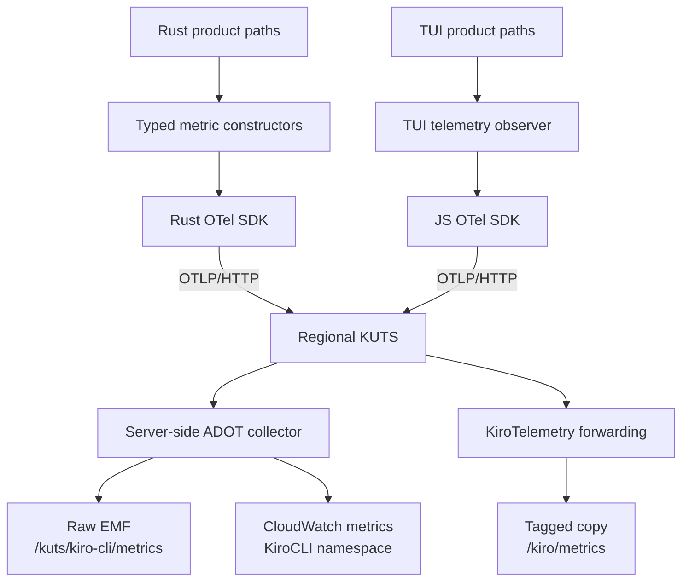

# Telemetry development

This is the developer SOP for adding and validating Kiro CLI metrics. The canonical emitted catalog is
[`metrics.yaml`](../../crates/kiro-telemetry-schema/schema/metrics.yaml), and the
[KUTS architecture and dimension review](../../docs/design/kuts-metric-dimension-review.md) explains
the product question, count point, and dimension decisions for each metric. Use the
[operator guide](../../docs/oncall/metrics_and_telemetry.md) after deployment.

## Architecture



The main ownership boundaries are:

- `crates/kiro-telemetry-schema` owns metric names, kinds, units, attribute vocabularies, and
  CloudWatch dimension sets.
- `crates/kiro-telemetry` owns typed Rust constructors, schema validation, and OTLP export.
- `crates/kiro-telemetry-host`, `crates/kiro-telemetry-observer`, and the V1/V2 telemetry modules
  translate product events and process observations into typed records.
- `packages/tui/src/utils/tui-telemetry-observer.ts` owns TUI-visible V2/V3 observations and emits
  through `meter.ts`.
- KUTS owns the server-side ADOT `metric_declarations` that turn selected attributes into CloudWatch
  dimensions. Those declarations are deployed separately from this repository.

V1, V2, and V3/KAS share the same metric contracts, but the surface that can observe a fact exactly
once owns its producer. V1 owns its own session and turn observations; for V2/V3, the TUI owns
interactive session and turn observations while the Rust host owns external ACP observations. Do not
add a second producer just to make a metric available in another architecture.

The schema fields have different purposes:

- `attributes` are allowed on the OTLP datapoint and remain fields in raw EMF.
- `cloudwatch_dimensions` are the bounded subset that may identify CloudWatch series.

The KUTS declaration must match `cloudwatch_dimensions`. Local Prometheus retains all datapoint
attributes, so local tests cannot prove that a diagnostic field was excluded from CloudWatch
dimensions.

`allowed_values` validates a closed vocabulary. An attribute without `allowed_values` is intentionally
open, such as `version_full`, canonical service model IDs, or diagnostic `mcp_server_name`. Neither
form configures CloudWatch dimensions.

Legacy Toolkit and CodeWhisperer events remain independent compatibility channels. Adding a KUTS
metric does not imply that a legacy event should be added or removed.

## Add or change a metric

1. Write the exact product or operational question and the point where the event can be counted once.
   Check whether an existing counter plus metric math already answers it.
2. Choose the owner and instrument:
   - Counter for occurrences or additive quantities.
   - Histogram for distributions such as duration or size.
   - Observable gauge for current process state.
   - Derived ratios and rollups belong in CloudWatch, not in each client.
3. Choose only the dimensions needed by a dashboard, alarm, or operational comparison. Never use
   user, request, session, conversation, raw error, or arbitrary custom names as dimensions.
4. Update `crates/kiro-telemetry-schema/schema/types.yaml` for a new attribute or vocabulary value,
   then update `crates/kiro-telemetry-schema/schema/metrics.yaml` with its description, kind, unit,
   priority, temporality, attributes, and `cloudwatch_dimensions`. Every current client metric
   includes `version_full`.
5. Add or update the typed Rust constructor in
   `crates/kiro-telemetry/src/metric/contract.rs`. Rust product code must use this facade instead of
   raw `MetricRecord`, OTel instruments, or ad hoc attribute strings.
6. Add one representative constructor call to `catalog_metric_records()` in
   `crates/kiro-telemetry/src/testing.rs`.
7. Wire the producer at the owning count point and add a focused test for timing, dimensions, and
   duplicate suppression. Start from the nearest existing producer:
   - V1: `crates/chat-cli/src/telemetry/`
   - V2 host or external ACP: `crates/chat-cli-v2/src/telemetry/`
   - Shared agent events: `crates/kiro-telemetry-observer/`
   - Interactive V2/V3 client experience: `packages/tui/src/utils/tui-telemetry-observer.ts`
8. For a TUI-owned metric, update its observer unit test, the production TUI fixture, and the
   `tui_metrics` expectations in `validate-metrics-e2e.sh`.
9. Add the matching KUTS `metric_declarations` entry. Deploy that declaration before releasing the
   client; once explicit declarations are enabled, an undeclared metric is dropped.

When raw diagnostic context is required, keep it in `attributes` and omit it from
`cloudwatch_dimensions`. This is an exception for low-frequency, locally bounded records, not a way
to attach arbitrary logs to every metric.

## Validate a change

Run the schema and constructor contract tests:

```bash
cargo test -p kiro-telemetry-schema
cargo test -p kiro-telemetry --features test-support
```

Run focused tests for every producer you changed. For TUI telemetry:

```bash
cd packages/tui
bun test src/utils/__tests__/tui-telemetry-observer.test.ts
bun run typecheck
cd ../..
```

Run the complete local producer and dashboard validation:

```bash
bash dev/telemetry/validate-metrics-e2e.sh
```

This requires Finch, `curl`, `jq`, `sqlite3`, Bun, and the Rust toolchain.
Set `KEEP_STACK=1` to leave Grafana and Prometheus running after the script. The full validation
exercises the reviewed Rust catalog, the production TUI observer, a real V1 one-shot dual-write path,
Prometheus series, and provisioned Grafana queries.

Before release, verify:

- The expected metric kind, value, and attributes appear in Prometheus.
- Only the intended owner emits the metric for each engine and interface.
- Counters use `Sum`, and numerator and denominator metrics have compatible dimensions.
- Retired names are absent when a metric is being replaced.

Local validation proves producer output and OTLP transport, not KUTS declarations. Roll out in this
order:

1. Deploy compatible KUTS declarations for current and new clients.
2. Release the client producer.
3. Use the operator guide to confirm raw EMF fields, exact CloudWatch dimensions, series counts, and
   any derived expressions.
4. Remove retired declarations only after the supported client-adoption window.

## Local telemetry stack

This stack lets you run `kiro-cli` locally and inspect OpenTelemetry metrics
in Grafana:

```text
kiro-cli ──OTLP/HTTP──▶ otel-collector ──▶ Prometheus ──▶ Grafana (metrics)
```

The local stack is **metrics-only** (Prometheus + Grafana). KUTS, the
production backend, does not support OTLP logs, so there is no log pipeline to
mirror locally.

## Start the stack with Finch

From this directory:

```bash
cd dev/telemetry
finch compose up -d
```

You can also start it from the repository root with
`finch compose -f dev/telemetry/compose.yaml up -d`.

Grafana is available at http://localhost:3000/d/kiro-telemetry-local/kiro-cli-local-telemetry.
Prometheus is at http://localhost:9090 and the collector's Prometheus exporter
is at http://localhost:9464/metrics.

To smoke-test the collector → Prometheus path before launching Kiro:

```bash
bash smoke-test.sh
```

To smoke-test the actual `kiro-telemetry` Rust emitter against the same stack:

```bash
bash smoke-kiro-telemetry.sh
```

To emit one record for every metric in the reviewed catalog and assert each
instrument is observed in Prometheus:

```bash
bash verify-catalog.sh
```

The same record set is asserted in CI by the `catalog_coverage` integration test
(`cargo test -p kiro-telemetry --features test-support --test catalog_coverage`),
which fails if any non-derived catalog metric lacks a typed constructor.

This stack is also exercised end-to-end by CI: the `tui-telemetry-e2e` job in
`.github/workflows/tui.yml` brings the stack up with `docker compose` and runs
`validate-metrics-e2e.sh`, which runs the real V1 binary in dual-write mode,
records both its OTLP and legacy Toolkit requests, then drives the Rust catalog
emitter and production TUI observer fixture (`emit-tui-metrics.fixture.ts`)
through their real code paths. It asserts the reviewed metric families and V1
dimensions in Prometheus, then checks the provisioned Grafana queries. It runs
whenever telemetry-relevant paths change, so these scripts are part of the test
suite.

## Run Kiro against the local collector

Build the TUI bundle first:

```bash
cd packages/tui
bun run build
cd ../..
```

Run V2 with the Rust agent engine:

```bash
KIRO_TELEMETRY_ENABLED=1 \
KIRO_TELEMETRY_OTEL=2 \
KIRO_TELEMETRY_OTLP_ENDPOINT=http://localhost:4318 \
KIRO_TELEMETRY_EXPORT_INTERVAL_MS=5000 \
KIRO_TEST_TUI_JS_PATH=$(pwd)/packages/tui/dist/tui.js \
cargo run -p chat_cli --bin chat_cli -- chat --tui
```

Run V2 with KAS:

```bash
KIRO_TELEMETRY_ENABLED=1 \
KIRO_TELEMETRY_OTEL=2 \
KIRO_TELEMETRY_OTLP_ENDPOINT=http://localhost:4318 \
KIRO_TELEMETRY_EXPORT_INTERVAL_MS=5000 \
KIRO_TEST_TUI_JS_PATH=$(pwd)/packages/tui/dist/tui.js \
cargo run -p chat_cli --bin chat_cli -- chat --agent-engine=kas
```

`KIRO_TELEMETRY_EXPORT_INTERVAL_MS=5000` shortens the OpenTelemetry metric export interval
for local development. The production default remains 60 seconds.

The Rust CLI still honors the normal privacy gates. If telemetry is disabled in settings or with
`KIRO_DISABLE_TELEMETRY`, the local stack should not receive product telemetry.

## Check that data arrived

After starting a chat and sending at least one prompt, refresh the Grafana dashboard or query
Prometheus directly:

```bash
curl -G -s http://localhost:9090/api/v1/query \
  --data-urlencode 'query={job="otel-collector", __name__=~"cli_session.*|chat_session.*|chat_cli.*|kiro_cli.*"}'
```

The collector also prints detailed OTLP metric payloads:

```bash
finch compose logs -f otel-collector
```

## Stop the stack

```bash
cd dev/telemetry
finch compose down
```

Add `-v` if you also want to wipe Prometheus state between runs.
