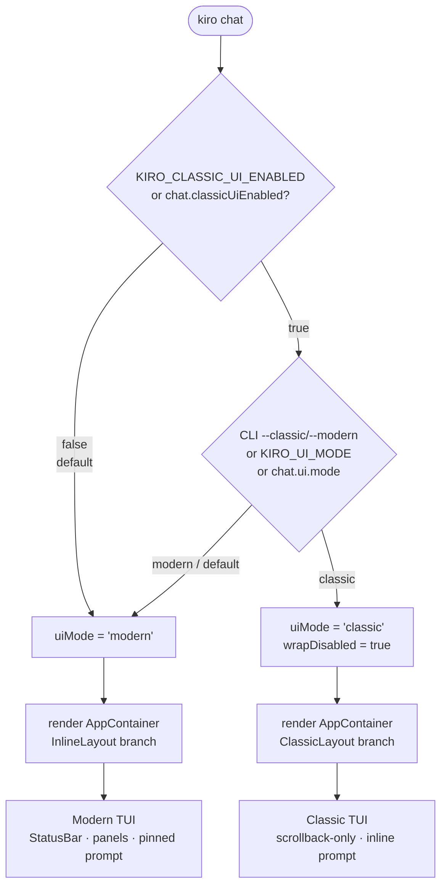
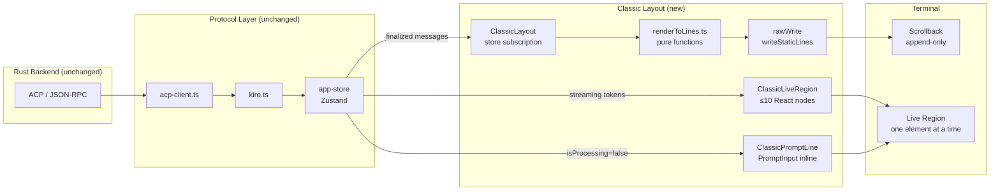
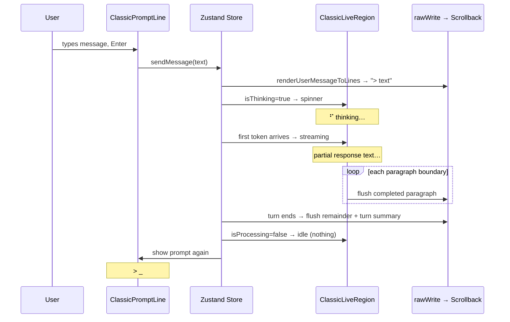
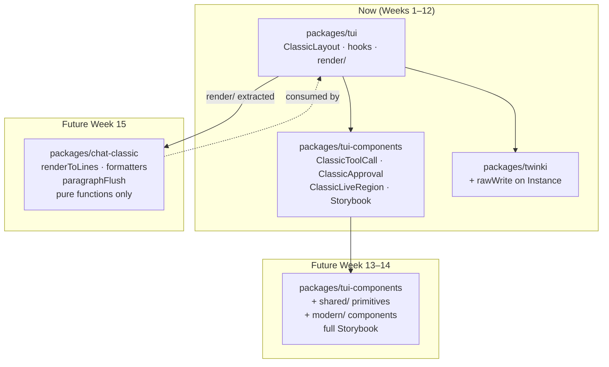

# Classic TUI Mode — Design Document

Status: Draft  
Date: 2026-05-11  
Author: kennvene

---

## Executive Summary

Classic TUI Mode adds a minimal, scrollback-friendly interface to Kiro CLI V2. Users who prefer a traditional command-line feel — plain text streaming to stdout, no full-screen chrome, output that works with `less`, `tee`, and copy-paste — can opt in via a setting, environment variable, or CLI flag. Modern mode remains the default and is completely unchanged. The implementation is a thin layout layer over the existing shared infrastructure: the same ACP backend, the same Zustand store, the same session management. No backend changes are required.

---

## Problem

Kiro CLI V2 ships a rich terminal UI built with React and Twinki. This works well for users who want a visual, IDE-like experience. However, many CLI users prefer a minimal interface that behaves like a traditional command-line tool: text streaming to stdout, no full-screen takeover, no UI chrome, and output that plays nicely with scrollback, pipes, `less`, and copy-paste. V1 provided exactly this experience. As V2 becomes the default, there is no way for users to get that classic feel while still benefiting from the V2 backend (ACP protocol, multi-model support, improved agent engine).

---

## Goals

1. Provide a "classic" UI mode within the V2 TypeScript architecture that is minimal and scrollback-friendly.
2. Reuse the entire V2 protocol and state layer — no backend changes.
3. Leave modern mode completely unchanged.
4. Keep the implementation thin enough that an intern can execute it with guidance.

---

## Tenets (in priority order)

1. **Scrollback is sacred.** Every piece of finalized output lives in terminal scrollback. The user can scroll up, copy-paste, pipe to `less`, or `tee` to a file. Nothing is lost, nothing is repositioned after it is written.

2. **The terminal is an append-only stream.** Classic mode never moves the cursor over previously-written content (except the live region). This is what makes it compatible with pipes, scripts, and non-interactive use.

3. **Modern mode is untouched.** Zero changes to `InlineLayout` or any of its children. The mode switch is a routing decision at the `AppContainer` level. If classic mode breaks, modern mode is unaffected.

4. **Thin layer, not a fork.** Classic mode is a rendering skin over the same ACP backend, the same Zustand store, the same session management. No protocol changes, no duplicated business logic. When the backend improves, classic mode gets it for free.

5. **Feature flag always on.** Classic mode is permanently opt-in via `chat.classicUiEnabled`. It can be merged to main at any stage of development without risk. Users who don't enable it never see it.

6. **Viewport never overflows.** The live region (the only part that re-renders) is bounded to ≤10 lines. Content is flushed to scrollback progressively. The terminal never stutters, never flickers, never shows a half-rendered frame.

7. **Pure functions over React for committed content.** Finalized messages are rendered by pure TypeScript functions (`renderToLines.ts`) and written directly to scrollback via `rawWrite`. The React reconciler only manages the live region (≤10 nodes). This minimizes CPU cost and makes the render layer independently testable and extractable.

8. **Every component is independently demoable.** Classic components live in `packages/tui-components` with Storybook stories for every visual state. You can preview any component without running the full TUI or connecting to a backend.

---

## Non-Goals

- Multi-session / crew monitor in classic mode.
- Panel overlays (help, tools, MCP, knowledge, code, usage panels).
- Pixel-perfect V1 reproduction.
- Changes to the Rust backend or ACP protocol.

---

## Architecture

### Diagram 1 — Startup and Mode Resolution



### Diagram 2 — Rendering Architecture



### Diagram 3 — Conversation Turn Lifecycle



### Diagram 4 — Package Structure and Extraction Roadmap



### Feature Flag Gate

Classic mode is gated by a boolean feature flag so it can be merged to main at any stage without exposing an incomplete UI to users.

Resolution in `index.tsx`, evaluated before `resolveUiMode()`:

```
env var KIRO_CLASSIC_UI_ENABLED=1
  → persisted setting chat.classicUiEnabled (bool, default false)
```

```ts
const classicUiEnabled =
  process.env.KIRO_CLASSIC_UI_ENABLED === '1' ||
  readBoolSetting(Settings.CHAT_CLASSIC_UI_ENABLED, false);

const uiMode = classicUiEnabled ? resolveUiMode() : 'modern';
```

When `classicUiEnabled` is false, `resolveUiMode()` is never called and `ClassicLayout` is never rendered. The entire classic code path is dead. Developers and QA enable it with `KIRO_CLASSIC_UI_ENABLED=1` or `q settings chat.classicUiEnabled true`. The flag remains permanently — classic mode is always opt-in.

### Mode Selection

A new setting `chat.ui.mode` controls which layout is rendered. Resolution order, from highest to lowest priority:

```
CLI flag --classic / --modern
  → env var KIRO_UI_MODE=classic|modern
    → persisted setting chat.ui.mode
      → default: modern
```

The value is resolved once at startup in `index.tsx`, alongside the existing `wrapDisabled` resolution. Classic mode implies `wrapDisabled=true` — the same overflow-wrapping and no-StatusBar-chrome behavior that `chat.disableWrap` already provides, extended to the full layout.

### Rendering Model

The fundamental difference from modern mode is that classic mode treats the terminal as an append-only output stream. Instead of maintaining a live viewport with a pinned prompt bar at the bottom, classic mode pushes all finalized content into Twinki `<Static>` items and keeps only the currently-active element in the live region.

```
Terminal scrollback (Static items, append-only)
  ├── Welcome line (one-time)
  ├── User turn N:   "> your message"
  ├── Tool call N:   "⚙ read_file src/main.rs … done"
  ├── Agent turn N:  "  Here is the content…"
  ├── User turn N+1: "> next message"
  └── …

Live region (one thing at a time)
  ├── Thinking:  "⠋ thinking…"
  ├── Streaming: "  partial response text…"
  ├── Approval:  "Allow bash: rm -rf /tmp/x? [y/n/t]: "
  └── Input:     "> _"
```

No pinned PromptBar. The input prompt appears inline after the last output, as part of the conversation flow. When the user submits, their input becomes part of the scrollback and the agent response streams below it.

### Component Hierarchy

```
AppContainer
  └── ClassicLayout                    ← NEW: replaces InlineLayout when uiMode==='classic'
        ├── ClassicConversation        ← Static items: finalized messages, tool calls, approvals
        ├── ClassicStreamingRegion     ← Live region: thinking indicator OR streaming text
        └── ClassicPromptLine          ← Live region: inline input prompt (not pinned)
```

`ClassicLayout` is the only new top-level component. It reads from the same Zustand store as `InlineLayout` and delegates rendering to three focused sub-components.

### Streaming Flush Strategy

During a long agent response, the live region must not grow unboundedly. The strategy is paragraph-based flushing: when a complete paragraph boundary is detected in the streaming content (a blank line, a completed code fence, or a completed table), the content up to that boundary is moved from the live region into a new `<Static>` item. The live region then contains only the content since the last flush.

This is conservative and correct: it never splits a markdown structure mid-render. The tradeoff is that a very long paragraph without blank lines stays in the live region until it ends. For the vast majority of agent responses this is acceptable. A future iteration can add a line-count fallback (flush after N lines even without a paragraph boundary) if needed.

Message-level flushing reuses `computeFlushSet` from `turn-flush-machine.ts` unchanged.

### Slash Command Output

Slash commands currently open overlay panels in modern mode. In classic mode they print inline text. The command infrastructure in the store already handles execution and returns structured data. Classic mode adds a `ClassicCommandFormatter` that converts that structured data to plain text — tables, lists, and key-value pairs — and pushes the result into the `<Static>` conversation as a system message.

### Approval UX

Approvals render as an inline prompt in the conversation flow. The user sees:

```
Allow bash: rm -rf /tmp/x?
  [y] Yes, once   [n] No   [t] Trust all tools
> _
```

A single keypress (`y`, `n`, `t`) submits the response. No Enter required. This matches V1 behavior and is simpler than the modal overlay in modern mode.

### Trust-All-Tools Gate

The existing `TrustAllToolsGate` component is a full-screen overlay. In classic mode, the gate is replaced by an inline prompt rendered the same way as a regular approval. The gate state machine (`trust-gate-state.ts`) is reused unchanged.

---

## What Is Reused

| Layer | Reused as-is |
|---|---|
| ACP client (`acp-client.ts`) | Yes |
| Session manager (`kiro.ts`) | Yes |
| Zustand store (`app-store.ts`) | Yes |
| Event types (`agent-events.ts`) | Yes |
| `computeFlushSet` / `turn-flush-machine.ts` | Yes |
| `MarkdownRenderer` | Yes, with `useOverflow=true` |
| `PromptInput` | Yes, rendered inline |
| `useKeypress` | Yes |
| Theme system / `useTheme()` | Yes |
| `ErrorBoundary` | Yes |
| All slash command handling | Yes |
| `readBoolSetting` / `cli-settings.ts` | Yes |

---

## What Is New

| New artifact | Purpose |
|---|---|
| `Settings.CHAT_UI_MODE` constant | Setting key |
| `resolveUiMode()` in `index.tsx` | Startup resolution of mode |
| `ClassicLayout.tsx` | Top-level layout component |
| `ClassicConversation.tsx` | Static conversation items |
| `ClassicStreamingRegion.tsx` | Live streaming / thinking region |
| `ClassicPromptLine.tsx` | Inline input prompt |
| `ClassicToolCall.tsx` | Compact one-line tool call renderer |
| `ClassicApproval.tsx` | Inline approval prompt |
| `ClassicCommandFormatter.ts` | Slash command output formatter |
| `useClassicFlush.ts` | Hook managing paragraph-based streaming flush |
| E2E tests for classic mode | Scrollback, tool calls, approvals, slash commands |

All new files live under `packages/tui/src/components/layout/classic/`.

---

## Open Design Decisions (Resolved)

**Prompt prefix.** Agent responses use no prefix — they stream as plain text. User messages are prefixed with `> ` (matching V1). This keeps the output clean for piping while still distinguishing turns visually.

**Tool call detail.** One line per tool call: `⚙ tool_name: brief description … [running|done|failed]`. No expansion in classic mode. The status updates in place while the tool is running, then flushes to Static when done.

**Streaming flush.** Paragraph-based (blank line or completed fence/table). Conservative and correct. Line-count fallback deferred to a future iteration.

**Subagent display.** Subagent tool calls are prefixed with the agent name: `⚙ [agent-name] tool_name: …`. No special nesting.

**Welcome / changelog.** A single plain-text welcome line is printed on startup: `Kiro v{version} — classic mode. Type /help for commands.` No branded WelcomeScreen component.

**Component granularity.** Separate small components (`ClassicToolCall`, `ClassicApproval`, etc.) rather than one monolithic layout. This makes each piece independently testable and easier for an intern to understand and modify.

**File organization.** All classic-mode components live in `packages/tui/src/components/layout/classic/`. The layout is registered in `AppContainer.tsx` as a new branch alongside `InlineLayout` and `ExpandedLayout`.

---

## Risks and Mitigations

**Twinki `<Static>` append-only constraint.** Static items must never be removed or reordered. The streaming flush strategy must only ever append. The existing `trim-static-items.ts` / `adjustStaticCursor()` infrastructure handles trimming when the list grows very long; classic mode will use the same mechanism.

**Markdown split mid-structure.** Paragraph-based flushing avoids splitting code fences and tables. The risk is a very long unflushed live region for dense prose. Acceptable for v1; a line-count fallback can be added later.

**`wrapDisabled` interaction.** Classic mode sets `wrapDisabled=true` implicitly. If a user has `chat.disableWrap=false` but `chat.ui.mode=classic`, classic mode wins and `wrapDisabled` is forced true. This is the correct behavior — classic mode requires overflow wrapping for scrollback correctness.

**Modern mode regression.** The mode switch happens entirely at the `AppContainer` routing level. `InlineLayout` and all its children are untouched. The only change to existing files is adding a new branch in `AppContainer.tsx` and a new constant in `settings.ts`.
