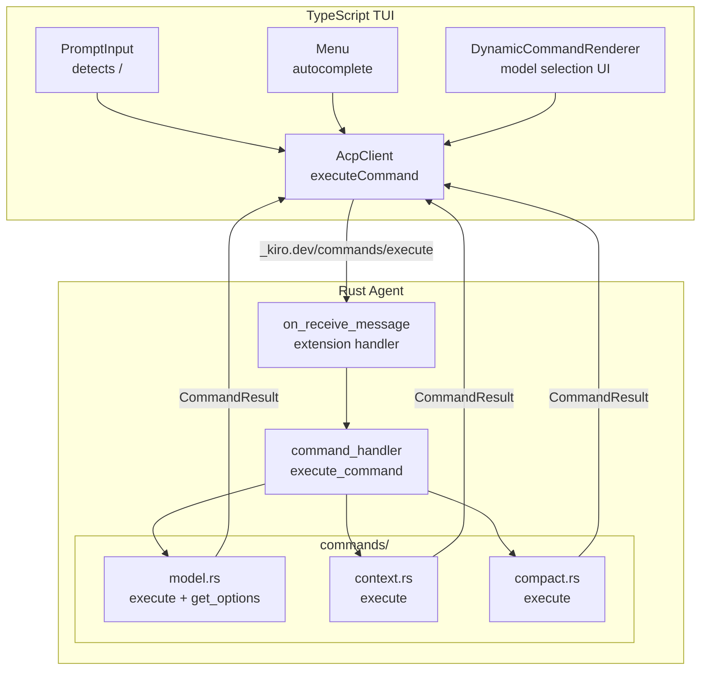
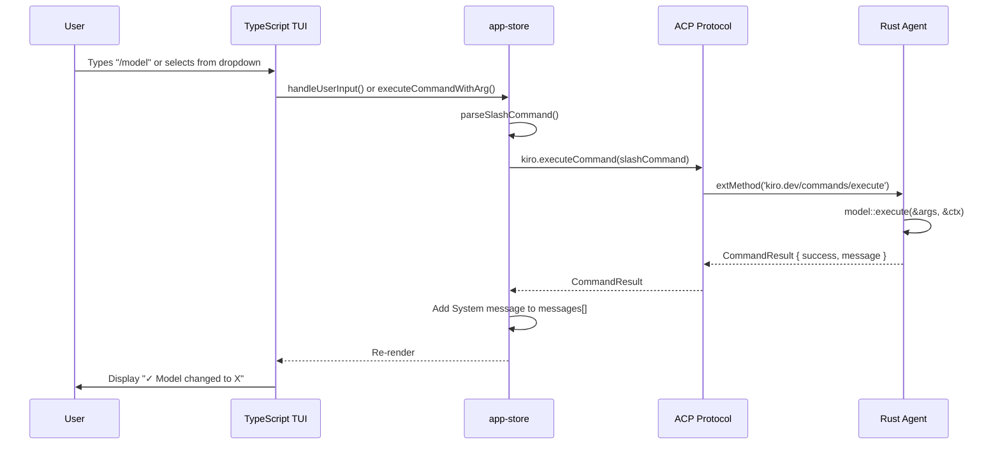

# Slash Commands System Design with ACP Protocol

## Overview

Strongly-typed slash command system using enum-based dispatch and custom ACP extension methods. Commands are executed via `_kiro.dev/commands/execute`, NOT as prompts.

**Important distinction:** This is separate from "slash commands" as defined in ACP (https://agentclientprotocol.com/protocol/slash-commands). ACP slash commands refer to prompt-based workflows that initiate a user turn. Our slash commands are internal TUI commands executed via extension methods.

## Architecture



## E2E Flow



## Key Files

### Type Definitions (agent crate - typeshare)

| File | Purpose |
|------|---------|
| `crates/agent/src/agent/slash_commands/command.rs` | `SlashCommand` enum + args structs |
| `crates/agent/src/agent/slash_commands/types.rs` | `CommandResult`, `CommandOption`, `ModelInfo` |

### Execution Logic (chat-cli crate)

| File | Purpose |
|------|---------|
| `crates/chat-cli/src/agent/acp/commands/mod.rs` | Dispatch to command modules |
| `crates/chat-cli/src/agent/acp/commands/model.rs` | `/model` execute + get_options |
| `crates/chat-cli/src/agent/acp/commands/context.rs` | `/context` execute |
| `crates/chat-cli/src/agent/acp/commands/compact.rs` | `/compact` execute |
| `crates/chat-cli/src/agent/acp/command_handler.rs` | Entry point, options_to_json |
| `crates/chat-cli/src/agent/acp/extensions.rs` | Request/response types, method constants |
| `crates/chat-cli/src/agent/acp/acp_agent.rs` | Extension method handler |

### TypeScript (TUI)

| File | Purpose |
|------|---------|
| `packages/tui/src/types/generated/agent.ts` | Generated types from typeshare |
| `packages/tui/src/acp-client.ts` | `executeCommand()`, `typedExtMethod()` |
| `packages/tui/src/stores/app-store.ts` | Command parsing, dispatch, System messages |
| `packages/tui/src/components/ui/ConversationView.tsx` | Renders System messages inline |

## Rust Types

### Extension Method Request Types

```rust
// crates/chat-cli/src/agent/acp/extensions.rs
#[derive(Debug, Clone, Deserialize)]
#[serde(rename_all = "camelCase")]
pub struct CommandExecuteRequest {
    pub session_id: SessionId,
    pub command: SlashCommand,
}

#[derive(Debug, Clone, Deserialize)]
#[serde(rename_all = "camelCase")]
pub struct CommandOptionsRequest {
    pub session_id: SessionId,
    #[serde(default)]
    pub partial: String,
}
```

### SlashCommand Enum (typeshare)

```rust
// crates/agent/src/agent/slash_commands/command.rs
#[typeshare]
#[serde(tag = "command", content = "args", rename_all = "camelCase")]
pub enum SlashCommand {
    Model(ModelArgs),
    Context(ContextArgs),
    Compact(CompactArgs),
}

#[typeshare]
pub struct ModelArgs {
    #[serde(skip_serializing_if = "Option::is_none")]
    pub model_name: Option<String>,
}

#[typeshare]
pub struct ContextArgs {
    #[serde(default)]
    pub verbose: bool,
}

#[typeshare]
pub struct CompactArgs {
    #[serde(skip_serializing_if = "Option::is_none")]
    pub target_tokens: Option<u32>,
}
```

### Command Execution Pattern

```rust
// crates/chat-cli/src/agent/acp/commands/mod.rs
pub struct CommandContext<'a> {
    pub api_client: &'a ApiClient,
    pub rts_state: &'a Arc<RtsState>,
}

pub async fn execute(command: SlashCommand, ctx: &CommandContext<'_>) -> CommandResult {
    match command {
        SlashCommand::Model(ref args) => model::execute(args, ctx).await,
        SlashCommand::Context(ref args) => context::execute(args, ctx),
        SlashCommand::Compact(ref args) => compact::execute(args, ctx),
    }
}
```

```rust
// crates/chat-cli/src/agent/acp/commands/model.rs
pub async fn execute(args: &ModelArgs, ctx: &CommandContext<'_>) -> CommandResult {
    match &args.model_name {
        None => list_models(ctx).await,
        Some(name) => switch_model(name, ctx),
    }
}

pub async fn get_options(partial: &str, ctx: &CommandContext<'_>) -> CommandOptionsResponse {
    // Fetch and filter models for autocomplete
}
```

### Generated TypeScript

```typescript
// packages/tui/src/types/generated/agent.ts
export type SlashCommand = 
    | { command: "model", args: ModelArgs }
    | { command: "context", args: ContextArgs }
    | { command: "compact", args: CompactArgs };

export interface ModelArgs {
    modelName?: string;
}

export interface ContextArgs {
    verbose?: boolean;
}

export interface CompactArgs {
    targetTokens?: number;
}
```

## Protocol Flow

### 1. Session Start: Advertise Commands

Agent sends `available_commands_update` after `session/new`:

```rust
let commands: Vec<SacpAvailableCommand> = SlashCommand::all_commands()
    .into_iter()
    .map(|cmd| {
        let mut sacp_cmd = SacpAvailableCommand::new(cmd.name(), cmd.description());
        if matches!(cmd, SlashCommand::Model(_)) {
            sacp_cmd = sacp_cmd.meta(json!({
                "optionsMethod": "_kiro.dev/commands/model/options",
                "inputType": "selection"
            }));
        }
        sacp_cmd
    })
    .collect();
```

### 2. Execute Command

```typescript
// acp-client.ts
async executeCommand(command: SlashCommand): Promise<CommandResult> {
  return await this.connection.extMethod('kiro.dev/commands/execute', {
    sessionId: this.sessionId,
    command,
  });
}
```

### 3. Get Options (Autocomplete)

```typescript
async getCommandOptions(commandName: string, partial: string): Promise<CommandOptionsResponse> {
  return await this.connection.extMethod(`kiro.dev/commands/${commandName}/options`, {
    sessionId: this.sessionId,
    partial,
  });
}
```

## Extension Method Constants

```rust
// crates/chat-cli/src/agent/acp/extensions.rs
pub mod methods {
    pub const COMMAND_EXECUTE: &str = "_kiro.dev/commands/execute";
    pub const COMMAND_OPTIONS_PREFIX: &str = "_kiro.dev/commands/";
    pub const COMMAND_OPTIONS_SUFFIX: &str = "/options";
}
```

## TUI Rendering

System messages (command results) are rendered inline with conversation turns in chronological order:

```
┌─────────────────────────────────────────────────────────────────────┐
│  User: /model                                                       │
│  [Selection UI appears]                                             │
│  User selects: claude-sonnet-4                                      │
└─────────────────────────────────────────────────────────────────────┘
                              ↓
┌─────────────────────────────────────────────────────────────────────┐
│  ✓ Model changed to claude-sonnet-4                                 │
└─────────────────────────────────────────────────────────────────────┘
```

Message roles:
- `MessageRole.User` - User prompts (starts a conversation turn)
- `MessageRole.Model` - LLM responses  
- `MessageRole.ToolUse` - Tool execution
- `MessageRole.System` - Command results (standalone, not part of turns)

## Adding New Commands

1. **Add enum variant** in `crates/agent/src/agent/slash_commands/command.rs`:
   ```rust
   pub enum SlashCommand {
       // ...existing...
       NewCommand(NewCommandArgs),
   }
   
   #[typeshare]
   pub struct NewCommandArgs { /* fields */ }
   ```

2. **Update enum methods** (`name()`, `description()`, `all_commands()`)

3. **Create command module** `crates/chat-cli/src/agent/acp/commands/new_command.rs`:
   ```rust
   pub fn execute(args: &NewCommandArgs, ctx: &CommandContext<'_>) -> CommandResult {
       // Implementation
   }
   ```

4. **Add to dispatch** in `commands/mod.rs`:
   ```rust
   SlashCommand::NewCommand(ref args) => new_command::execute(args, ctx),
   ```

5. **Regenerate types**: `./scripts/generate-types.sh`

6. **Update TUI** if needed (parsing, UI components)

## Design Rationale

### Why Enum over Trait Objects?

| Enum | Trait Object |
|------|--------------|
| `#[typeshare]` generates TS types | Can't share trait objects with TS |
| Exhaustive match = compile-time safety | Runtime dispatch, easy to miss cases |
| Serializable across ACP boundary | Need manual serialization layer |
| Single source of truth | Types diverge between Rust/TS |

### Why Separate Crates?

- **agent crate**: Types only (for typeshare). No dependencies on ApiClient.
- **chat-cli crate**: Execution logic. Has access to ApiClient, RtsState.

This separation allows the enum to be shared via typeshare while keeping execution logic where the dependencies live.

## Comparison: Our Commands vs ACP Slash Commands

| Aspect | Our Slash Commands | ACP Slash Commands |
|--------|-------------------|-------------------|
| Purpose | Internal TUI commands | Prompt-based workflows |
| Execution | Extension method | session/prompt request |
| Typing | Strongly-typed enum | String-based |
| Examples | /model, /context, /compact | MCP prompts |
| Protocol | `_kiro.dev/commands/execute` | Standard ACP prompt flow |
