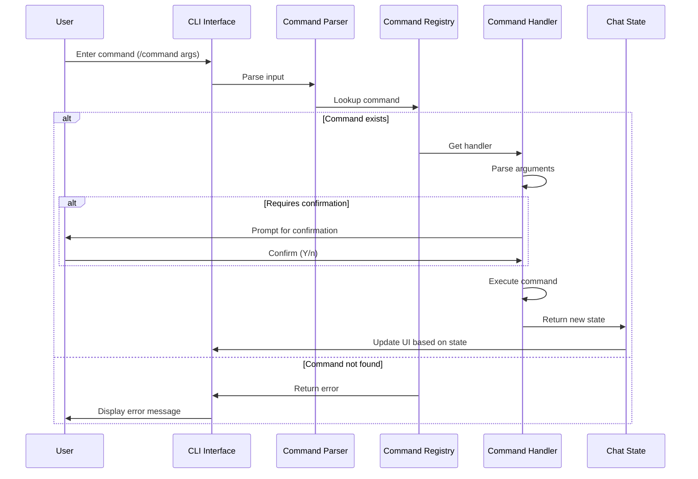
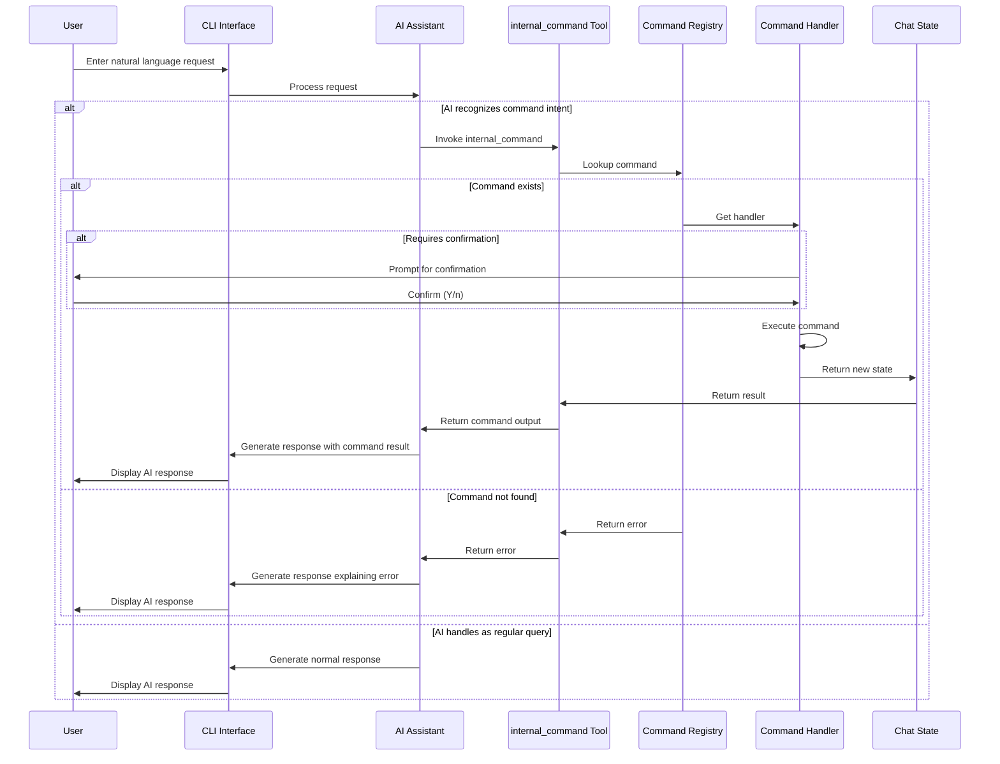
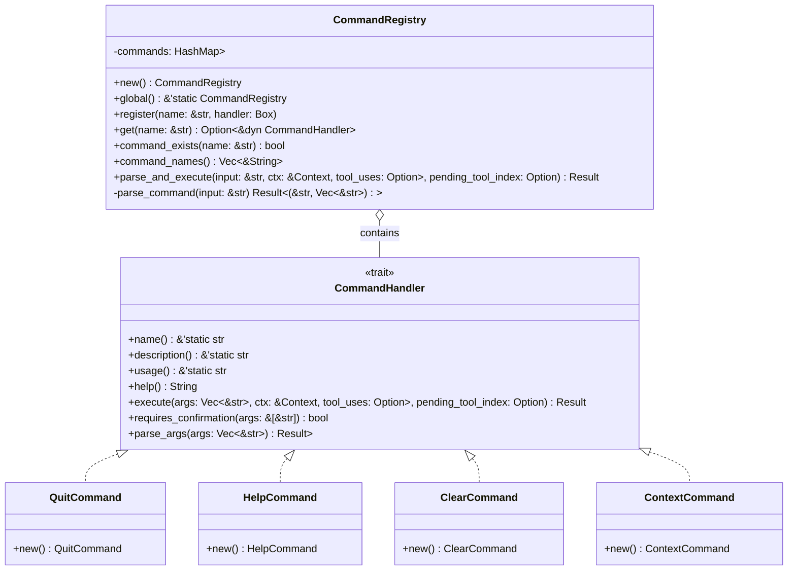
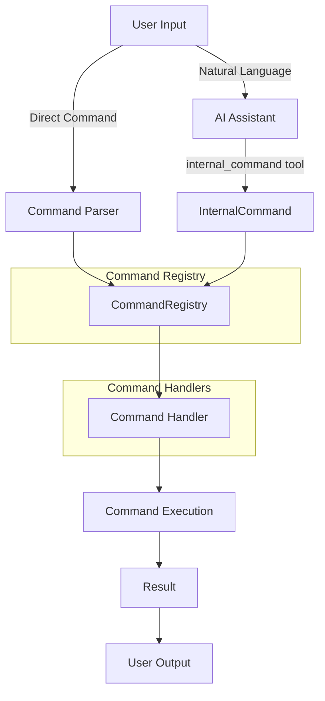
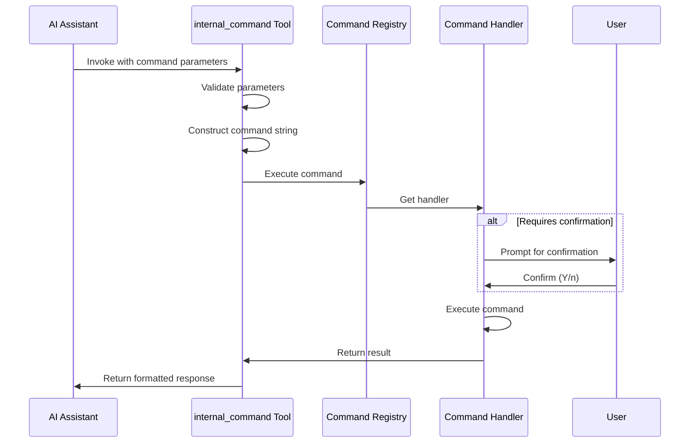
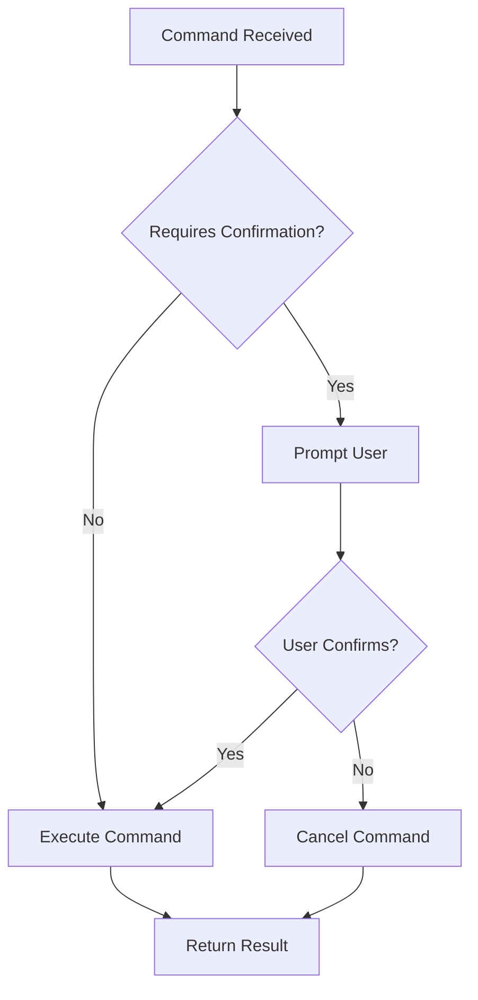

# Command Execution Flow

This document describes the command execution flow in the Amazon Q CLI, focusing on how commands are processed from user input to execution, particularly with the `internal_command` tool integration (previously called `use_q_command`).

## Overview

The Amazon Q CLI supports two primary methods for executing commands:

1. **Direct Command Execution**: User types a command directly in the CLI (e.g., `/help`)
2. **AI-Assisted Command Execution**: User expresses intent in natural language, and the AI uses the `internal_command` tool to execute the appropriate command

Both paths ultimately use the same command handlers, ensuring consistent behavior regardless of how a command is invoked.

## Direct Command Execution Flow



## AI-Mediated Command Execution Flow



## Command Registry Architecture



## Command Execution Flow Diagram



## internal_command Tool Flow



## Detailed Flow

### 1. User Input Processing

#### Direct Command Path

- User enters a command with the `/` prefix (e.g., `/help`)
- The command parser identifies this as a command and extracts:
  - Command name (e.g., `help`)
  - Subcommand (if applicable)
  - Arguments (if any)

#### AI-Assisted Path

- User expresses intent in natural language (e.g., "Show me the available commands")
- The AI assistant recognizes the intent and invokes the `internal_command` tool
- The tool constructs a command with:
  - Command name (e.g., `help`)
  - Subcommand (if applicable)
  - Arguments (if any)

### 2. Command Registry

Both paths converge at the `CommandRegistry`, which:

- Validates the command exists
- Retrieves the appropriate command handler
- Passes the command, subcommand, and arguments to the handler

### 3. Command Handler

The command handler:

- Validates arguments
- Checks if user confirmation is required
- Performs the command's action
- Returns a result indicating success or failure

### 4. Command Execution

Based on the handler's result:

- Updates the chat state if necessary
- Formats output for the user
- Handles any errors that occurred

### 5. User Output

The result is presented to the user:

- Success message or command output
- Error message if something went wrong
- Confirmation prompt if required

## Security Considerations

The command execution flow includes several security measures:

### Command Validation

All commands are validated before execution to ensure they are recognized internal commands. Unknown commands are rejected with an error message.

### User Confirmation

Commands that modify state or perform destructive actions require user confirmation:



### Trust System

The CLI implements a trust system for tools and commands:

- Users can trust specific commands to execute without confirmation
- Trust can be granted for a single session or permanently
- Trust can be revoked at any time

## Command Handler Interface

All command handlers implement the `CommandHandler` trait:

```rust
pub trait CommandHandler: Send + Sync {
    /// Execute the command with the given arguments
    async fn execute(
        &self,
        args: &[&str],
        context: &Context,
        input: Option<&str>,
        output: Option<&mut dyn Write>,
    ) -> Result<ChatState>;

    /// Check if the command requires confirmation before execution
    fn requires_confirmation(&self, args: &[&str]) -> bool;

    /// Get the name of the command
    fn name(&self) -> &'static str;

    /// Get a description of the command
    fn description(&self) -> &'static str;

    /// Get a description of the command for the LLM
    fn llm_description(&self) -> &'static str;
}
```

## internal_command Tool Integration

The `internal_command` tool provides a bridge between natural language processing and command execution:

```rust
pub struct InternalCommand {
    /// The command to execute (e.g., "help", "context", "profile")
    pub command: String,
    
    /// Optional subcommand (e.g., "add", "remove", "list")
    pub subcommand: Option<String>,
    
    /// Optional arguments for the command
    pub args: Option<Vec<String>>,
}
```

When invoked, the tool:

1. Constructs a command string from the provided parameters
2. Passes the command to the `CommandRegistry`
3. Returns the result to the AI assistant

## Testing Strategy

The command execution flow is tested at multiple levels:

### Unit Tests

- Test individual command handlers in isolation
- Verify argument parsing and validation
- Check confirmation requirements

### Integration Tests

- Test the complete flow from command string to execution
- Verify both direct and AI-assisted paths produce identical results
- Test error handling and edge cases

### End-to-End Tests

- Test the complete system with real user input
- Verify AI recognition of command intents
- Test complex scenarios with multiple commands

## Example: Help Command Execution

### Direct Path

1. User types `/help`
2. Command parser extracts command name `help`
3. `CommandRegistry` retrieves the `HelpCommand` handler
4. `HelpCommand::execute` is called with empty arguments
5. Help text is displayed to the user

### AI-Assisted Path

1. User asks "What commands are available?"
2. AI recognizes intent and calls `internal_command` with `command: "help"`
3. `InternalCommand` constructs command string `/help`
4. `CommandRegistry` retrieves the `HelpCommand` handler
5. `HelpCommand::execute` is called with empty arguments
6. Help text is displayed to the user

## Implementation Considerations

1. **Command Validation**: All commands should be validated before execution, both in direct and AI-mediated flows.

2. **Confirmation Handling**: Commands that require confirmation should prompt the user in both flows.

3. **Error Handling**: Errors should be properly propagated and displayed to the user in a consistent manner.

4. **State Management**: The chat state should be updated consistently regardless of how the command was invoked.

5. **Security**: Commands executed through the AI should have the same security checks as direct commands.

6. **Telemetry**: Track command usage patterns for both direct and AI-mediated execution.

7. **Testing**: Test both execution paths thoroughly to ensure consistent behavior.

## Conclusion

The command execution flow in Amazon Q CLI provides a consistent and secure way to execute commands, whether they are entered directly by the user or through AI assistance. The unified path through the `CommandRegistry` ensures that commands behave identically regardless of how they are invoked, while the security measures protect against unintended actions.