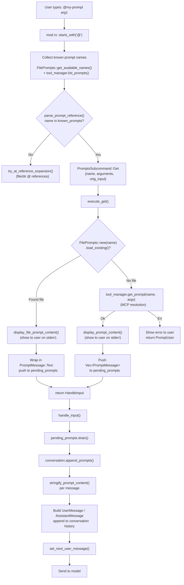
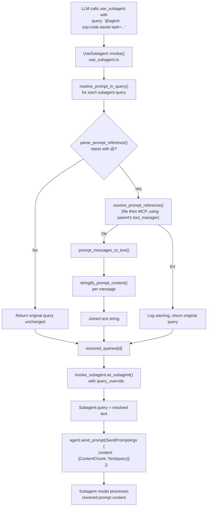

# Prompt Resolution

How `@prompt-name args` references are parsed, resolved, and delivered to the model in both the main agent and subagent paths.

## Shared Functions (`cli/chat/cli/prompts.rs`)

| Function | Purpose |
|----------|---------|
| `parse_prompt_reference(input)` | Parses `@name [args...]` → `(name, Option<Vec<String>>)` |
| `resolve_prompt_reference(name, args, os, tool_manager)` | Resolves name to `Vec<PromptMessage>` via file or MCP |
| `stringify_prompt_content(content)` | Converts one `PromptMessageContent` → `String` for model input |
| `prompt_messages_to_text(messages)` | Joins all messages via `stringify_prompt_content` |

## Main Agent Path

User types `@my-prompt arg1` in the chat input.

## Subagent Path

The main agent's LLM calls `use_subagent` with a query like `@agent-sop:code-assist task_description="fix bug"`.

## Known Gaps (Subagent Path)

- **No known-prompt check**: The main agent only resolves `@name` if `name` is in the set of known file + MCP prompts. The subagent path attempts resolution for any `@`-prefixed query, which could collide with `@file-references` or fail on unknown names (falls back to raw query).
- **No conflict detection**: When both a file prompt and an MCP prompt share the same name, the main agent warns the user. The subagent path silently uses the file prompt.
- **Text only**: Subagents receive `ContentChunk::Text`. Non-text `PromptMessageContent` (Image, Resource, ResourceLink) is stringified via `stringify_prompt_content` but ultimately flattened to text.

| Aspect | Main Agent | Subagent |
|--------|-----------|----------|
| Input source | User keyboard input | LLM tool call parameter |
| Known-prompt check | Yes (only resolves known names) | No (attempts resolution for any `@` prefix) |
| Resolution context | Own `tool_manager` | Parent agent's `tool_manager` |
| Content delivery | `Vec<PromptMessage>` → `pending_prompts` → `append_prompts()` | `Vec<PromptMessage>` → `prompt_messages_to_text()` → `&str` |
| Multimodal support | Full (via `append_prompts`) | Text only (via `ContentChunk::Text`) |
| Error handling | Rich UI feedback to user | Log warning, fall back to raw query |
| Display to user | Yes (`display_prompt_content`) | No |
| Conflict detection | Yes (file vs MCP warning) | No (file wins silently) |
